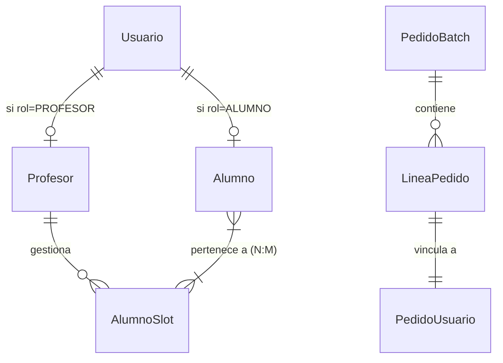

# Arquitectura del Sistema Smart Economat

## Descripción General
El sistema está diseñado para gestionar el economato de un centro educativo, permitiendo a profesores y alumnos realizar pedidos de productos para sus clases.

## Tecnologías Utilizadas
- **Backend**: NestJS, TypeORM, MySQL/MariaDB.
- **Frontend**: React (Vite), Tailwind CSS, Headless UI, Heroicons, Framer Motion.
- **Gestión de Estado**: Context API y Hooks personalizados.
- **Validación**: Zod / Class-validator.

## Módulos Principales

### 1. Gestión de Usuarios y Roles
- **Administrador**: Control total del sistema.
- **Staff**: Gestión de inventario, recepciones y distribuciones.
- **Profesor**: Realiza pedidos para sus clases (AlumnoSlots).
- **Alumno**: Realiza pedidos vinculados a las clases del profesor.

### 2. Gestión de Alumnos y Slots
- Un **Profesor** gestiona múltiples **AlumnoSlots** (clases/horarios).
- Un **AlumnoSlot** tiene una ubicación física (aula) predeterminada.
- Los **Alumnos** pueden estar vinculados a **múltiples AlumnoSlots** simultáneamente (relación Muchos-a-Muchos), permitiendo que un alumno asista a clases con diferentes profesores o en diferentes horarios.

### 3. Inventario y Productos
- Catálogo de productos organizado por categorías y alérgenos.
- Control de stock por ubicaciones.
- Gestión de proveedores y recepciones de mercancía.

### 4. Flujo de Pedidos y Estados
1. El usuario (alumno/profesor) añade productos al carrito.
2. El sistema sugiere la ubicación de entrega basada en los slots del usuario. Para alumnos con múltiples slots (relación Muchos-a-Muchos), se utiliza el primero como predeterminado en el pedido.
3. El staff recibe la mercancía del proveedor (Batch de Compra).
4. Al recibir la mercancía, los pedidos asociados pasan al estado **EN_ALMACEN** (antes ENTREGADO). Este estado indica que el producto está físicamente en el centro pero aún no ha sido distribuido al usuario final.
5. Se genera la distribución final a las aulas, tras la cual el proceso se considera completado.

## Diagrama de Entidades (Simplificado)

*Última actualización: 2024-04-02*
