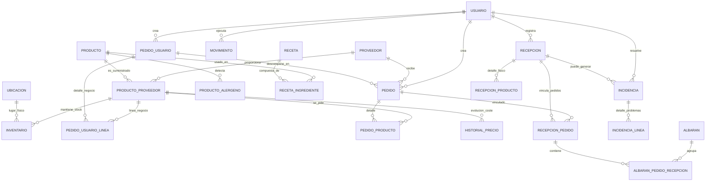

# Entidades y Relaciones (Backend)

Este documento detalla todas las entidades definidas en el backend de SmartEconomat, incluyendo sus campos, tipos de datos y funciones.

## Tabla de Contenidos
- [Entidades y Relaciones (Backend)](#entidades-y-relaciones-backend)
  - [Tabla de Contenidos](#tabla-de-contenidos)
  - [Diagrama de Relaciones Principales](#diagrama-de-relaciones-principales)
  - [Clase Base: BaseEntity](#clase-base-baseentity)
  - [Módulo: Albarán](#módulo-albarán)
    - [1. Albaran](#1-albaran)
    - [2. AlbaranPedidoRecepcion](#2-albaranpedidorecepcion)
  - [Módulo: Incidencia](#módulo-incidencia)
    - [3. Incidencia](#3-incidencia)
    - [4. IncidenciaLinea](#4-incidencialinea)
  - [Módulo: Inventario](#módulo-inventario)
    - [5. Inventario](#5-inventario)
    - [6. Ubicacion](#6-ubicacion)
  - [Módulo: Movimiento](#módulo-movimiento)
    - [7. Movimiento](#7-movimiento)
  - [Módulo: Pedido](#módulo-pedido)
    - [8. Pedido](#8-pedido)
    - [9. PedidoProducto](#9-pedidoproducto)
  - [Módulo: Producto](#módulo-producto)
    - [10. Producto](#10-producto)
    - [11. ProductoProveedor](#11-productoproveedor)
    - [12. HistorialPrecio](#12-historialprecio)
    - [13. ProductoAlergeno](#13-productoalergeno)
  - [Módulo: Proveedor](#módulo-proveedor)
    - [14. Proveedor](#14-proveedor)
  - [Módulo: Recepción](#módulo-recepción)
    - [15. Recepcion](#15-recepcion)
    - [16. RecepcionPedido](#16-recepcionpedido)
    - [17. RecepcionProducto](#17-recepcionproducto)
  - [Módulo: Receta](#módulo-receta)
    - [18. Receta](#18-receta)
    - [19. RecetaIngrediente](#19-recetaingrediente)
  - [Módulo: Usuario](#módulo-usuario)
    - [20. Usuario](#20-usuario)

---

## Diagrama de Relaciones Principales

---

## Clase Base: BaseEntity
Casi todas las entidades extienden de `BaseEntity`, la cual hereda los siguientes campos fundamentales:

| Campo | Tipo (DB) | Tipo (TS) | Función |
| :--- | :--- | :--- | :--- |
| **id** | UUID v7 | `string` | PK. Identificador único ordenado temporalmente (uuid_generate_v7). |
| **createdAt** | timestamptz | `Date` | Fecha de creación automática del registro. |
| **updatedAt** | timestamptz | `Date` | Fecha de última actualización automática. |
| **deletedAt** | timestamptz | `Date \| null` | Soft Delete. Marca de tiempo si fue borrado. |
| **deletedBy** | UUID | `string \| null` | Usuario responsable del borrado lógico. |
| **version** | integer | `number` | Versionado optimista para control de concurrencia. |

---

## Módulo: Albarán

### 1. Albaran
Representa un documento de entrega físico suministrado por el transportista/proveedor.

| Campo | Tipo (DB) | Tipo (TS) | Función |
| :--- | :--- | :--- | :--- |
| **nAlbaran** | varchar(50) | `string` | Número único de referencia del albarán (indexado). |
| **concordancia**| boolean | `boolean \| null`| Indica si coincide con los pedidos vinculados. |
| **fecha** | timestamptz | `Date \| null` | Fecha del documento de transporte. |

### 2. AlbaranPedidoRecepcion
Tabla puente que permite agrupar varios pedidos recepcionados en un único albarán físico.

| Campo | Tipo (DB) | Tipo (TS) | Función |
| :--- | :--- | :--- | :--- |
| **albaran** | FK (uuid) | `Relation<Albaran>` | Referencia al albarán (onDelete: CASCADE). |
| **recepcionPedido** | FK (uuid) | `Relation<RecepcionPedido>`| Referencia al vínculo pedido-recepción (onDelete: CASCADE). |

---

## Módulo: Incidencia

### 3. Incidencia
Cabecera de registro de discrepancias o problemas detectados durante una recepción.

| Campo | Tipo (DB) | Tipo (TS) | Función |
| :--- | :--- | :--- | :--- |
| **recepcion** | FK (uuid) | `Recepcion` | Recepción donde se generó (onDelete: CASCADE). |
| **pedido** | FK (uuid) | `Pedido \| null` | Pedido asociado (onDelete: RESTRICT). |
| **usuarioResolutor** | FK (uuid) | `Usuario \| null` | Usuario responsable de la resolución (onDelete: SET NULL). |
| **observacionesRecepcion** | text | `string \| null` | Notas generales del recepcionista. |
| **observacionesResolucion** | text | `string \| null` | Notas añadidas al resolver la incidencia. |
| **fechaResolucion** | timestamptz| `Date \| null` | Momento de cierre. Si es null, está PENDIENTE. |

### 4. IncidenciaLinea
Detalle atómico de cada discrepancia (por producto).

| Campo | Tipo (DB) | Tipo (TS) | Función |
| :--- | :--- | :--- | :--- |
| **incidencia** | FK (uuid) | `Relation<Incidencia>` | Cabecera (onDelete: CASCADE). |
| **pedidoProducto**| FK (uuid) | `PedidoProducto` | Línea de pedido original afectada (onDelete: RESTRICT). |
| **cantidadEsperada**| numeric(12,3)| `number` | Cantidad que figuraba en el pedido. |
| **cantidadRecibida**| numeric(12,3)| `number` | Cantidad realmente entregada. |
| **diferencia** | numeric(12,3)| `number` | Resultado matemático (esperada - recibida). |
| **tipoDiferencia**| enum | `TipoDiferencia`| FALTANTE, EXCESO, DEFECTUOSO. |
| **estadoReclamacion**| enum | `EstadoReclamacion`| PENDIENTE, RECLAMADO, ABONADO, REENVIADO. |
| **observaciones** | text | `string \| null` | Notas detalladas del problema en este producto. |

---

## Módulo: Inventario

### 5. Inventario
Representa el stock actual de un producto de un proveedor específico en una ubicación.

| Campo | Tipo (DB) | Tipo (TS) | Función |
| :--- | :--- | :--- | :--- |
| **productoProveedor**| FK (uuid) | `Relation<ProductoProveedor>`| Referencia al producto+proveedor (onDelete: RESTRICT). |
| **cantidadActual**| numeric(12,3)| `number` | Stock físico disponible (Check >= 0). |
| **cantidadMinima**| numeric(12,3)| `number` | Stock de seguridad para alertas. |
| **cantidadMaxima**| numeric(12,3)| `number \| null`| Capacidad máxima (Check > cantidadMinima). |
| **ubicacion** | FK (uuid) | `Relation<Ubicacion>` | Lugar físico del almacén (onDelete: RESTRICT). |
| **fechaEntrada** | timestamptz | `Date` | Fecha de entrada al inventario (default: NOW). |
| **fechaCaducidad**| timestamptz | `Date \| null`| Fecha de caducidad del lote. |

### 6. Ubicacion
Maestro de lugares físicos configurables.

| Campo | Tipo (DB) | Tipo (TS) | Función |
| :--- | :--- | :--- | :--- |
| **nombre** | varchar(150)| `string` | Nombre único de la ubicación (ej: "Sótano A"). |
| **descripcion** | varchar(255)| `string \| null` | Notas sobre el uso de la ubicación. |

---

## Módulo: Movimiento

### 7. Movimiento
Registro histórico (auditoría) de cualquier cambio en las cantidades de stock.

| Campo | Tipo (DB) | Tipo (TS) | Función |
| :--- | :--- | :--- | :--- |
| **tipo** | enum | `TipoMovimiento` | entrada, salida, ajuste, pedido, entrada_compra. |
| **cantidad** | numeric(12,3)| `number` | Cantidad movida (en absoluto, >= 0). |
| **usuario** | FK (uuid) | `Usuario \| null` | Autor de la operación (onDelete: SET NULL). |
| **inventario** | FK (uuid) | `Inventario \| null`| Registro de inventario afectado (onDelete: SET NULL). |
| **productoProveedor**| FK (uuid) | `ProductoProveedor \| null`| Referencia denormalizada para consultas rápidas. |
| **entidadTipo** | varchar(50) | `string` | Nombre de la entidad origen (Recepcion, AjusteManual). |
| **entidadId** | uuid | `string` | ID del registro que causó el movimiento. |
| **descripcion** | text | `string \| null` | Justificación del movimiento. |

---

## Módulo: Pedido

El módulo de pedidos se divide ahora en tres conceptos distintos:

- `PedidoUsuario`: pedido de negocio visible para el usuario.
- `Pedido`: pedido interno por proveedor.
- `PurchaseBatch`: consolidación administrativa de compras.

### PedidoUsuario
Agregado principal de negocio. Es el pedido que aparece en “Mis pedidos” y en la vista semanal.

| Campo | Tipo (DB) | Tipo (TS) | Función |
| :--- | :--- | :--- | :--- |
| **usuario** | FK (uuid) | `Relation<Usuario> \| null` | Usuario que crea el pedido de negocio (onDelete: SET NULL). |
| **numeroGlobal** | bigint autoincrement | `string` | Numeración global incremental visible para negocio. |
| **fechaPedido** | timestamptz | `Date` | Fecha de creación del agregado. |
| **fechaEntrega** | timestamptz | `Date \| null` | Fecha estimada calculada por backend. |
| **costeTotal** | numeric(14,4) | `number` | Coste total agregado de todas las líneas/proveedores. |
| **estado** | enum | `EstadoPedido` | `pendiente_de_aprobacion`, `por_recepcionar`, `recepcionado`, `incidencia`, `cancelado`, `parcial`. |
| **observaciones** | text | `string \| null` | Notas generales del pedido de negocio. |

### PedidoUsuarioLinea
Línea del agregado de negocio antes de la separación por proveedor.

| Campo | Tipo (DB) | Tipo (TS) | Función |
| :--- | :--- | :--- | :--- |
| **pedidoUsuario** | FK (uuid) | `Relation<PedidoUsuario>` | Cabecera de negocio (onDelete: CASCADE). |
| **productoProveedor** | FK (uuid) | `Relation<ProductoProveedor>` | Producto proveedor elegido por el usuario. |
| **cantidad** | numeric(12,3) | `number` | Cantidad solicitada. |
| **precioUnitario** | numeric(12,4) | `number` | Precio vigente congelado al crear el pedido. |
| **observaciones** | text | `string \| null` | Observaciones opcionales de la línea. |

### 8. Pedido
Pedido interno operativo realizado a un proveedor.

| Campo | Tipo (DB) | Tipo (TS) | Función |
| :--- | :--- | :--- | :--- |
| **usuario** | FK (uuid) | `Relation<Usuario> \| null` | Solicitante del pedido (onDelete: SET NULL). |
| **proveedor** | FK (uuid) | `Relation<Proveedor> \| null`| Proveedor adjudicatario (onDelete: RESTRICT). |
| **pedidoUsuarioId** | FK (uuid) | `string \| null` | Referencia opcional al agregado `PedidoUsuario`. |
| **batchId** | FK (uuid) | `string \| null` | Referencia opcional a `PurchaseBatch` cuando el pedido se consolida en compras. |
| **fechaPedido** | timestamptz | `Date` | Fecha de emisión (default: NOW). |
| **fechaEntrega** | timestamptz | `Date \| null` | Fecha prevista de llegada o real. |
| **costeTotal** | numeric(14,4)| `number` | Coste calculado (Check >= 0). |
| **estado** | enum | `EstadoPedido` | `pendiente_de_aprobacion`, `por_recepcionar`, `recepcionado`, `incidencia`, `cancelado`, `parcial`. |
| **motivoCancelacion**| text | `string \| null` | Obligatorio si el estado es 'cancelado'. |

### 9. PedidoProducto
Línea de detalle del pedido. Congela el precio en el momento de la compra.

| Campo | Tipo (DB) | Tipo (TS) | Función |
| :--- | :--- | :--- | :--- |
| **pedido** | FK (uuid) | `Relation<Pedido>` | Cabecera (onDelete: RESTRICT). |
| **productoProveedor**| FK (uuid) | `Relation<ProductoProveedor>`| Referencia al catálogo (onDelete: RESTRICT). |
| **pedidoUsuarioLineaId** | FK (uuid) | `string \| null` | Trazabilidad hasta la línea original de `PedidoUsuarioLinea`. |
| **cantidad** | numeric(12,3)| `number` | Cantidad solicitada (Check > 0). |
| **precioUnitario**| numeric(12,4)| `number` | Precio unitario acordado (Check >= 0). |
| **observaciones** | text | `string \| null` | Requisitos específicos para el proveedor. |

### PurchaseBatch
Lote administrativo de compra que agrupa varios `Pedido` internos ya existentes.

| Campo | Tipo (DB) | Tipo (TS) | Función |
| :--- | :--- | :--- | :--- |
| **usuario** | FK (uuid) | `Relation<Usuario> \| null` | Usuario que genera la consolidación. |
| **estado** | enum | `EstadoLote` | Estado de la compra consolidada. |
| **observaciones** | text | `string \| null` | Notas globales de la compra. |
| **pedidos** | relación | `Pedido[]` | Pedidos internos asociados al lote. |

`EstadoLote` se deriva automaticamente desde los `Pedido` asociados con esta prioridad: `cancelado` si todos estan cancelados, `incidencia` si alguno esta en incidencia, `completado` si todos estan recepcionados o cancelados, `parcial` si ya hay recepcion iniciada pero el lote no ha cerrado, y `pendiente` si aun no hay ninguna recepcion iniciada.

---

## Módulo: Producto

### 10. Producto
Ficha técnica genérica de un producto.

| Campo | Tipo (DB) | Tipo (TS) | Función |
| :--- | :--- | :--- | :--- |
| **nombre** | varchar(100)| `string` | Nombre comercial base. |
| **marca** | varchar(100)| `string \| null`| Fabricante sugerido. |
| **descripcion** | text | `string \| null` | Información nutricional o descriptiva. |
| **unidad** | enum | `UnidadProducto`| kg, g, l, ml, unidad, paq. |
| **fechaCaducidad**| timestamptz | `Date \| null` | Referencia (Check > createdAt). |
| **pathImg** | varchar(200)| `string \| null` | URL o path de la imagen. |
| **tipo** | enum | `TipoProducto` | verduras, carne, lacteos, etc. (ver Enum). |
| **codigoBarras** | varchar(50) | `string \| null` | EAN (único). |
| **contenido** | numeric(10,2)| `number` | Peso/Volumen neto por unidad. |

### 11. ProductoProveedor
Variante específica de un producto suministrada por un proveedor determinado.

| Campo | Tipo (DB) | Tipo (TS) | Función |
| :--- | :--- | :--- | :--- |
| **producto** | FK (uuid) | `Relation<Producto>`| Ficha técnica (onDelete: RESTRICT). |
| **proveedor** | FK (uuid) | `Relation<Proveedor>`| Suministrador (onDelete: RESTRICT). |
| **marca** | varchar(100)| `string \| null`| Marca propia que maneja este proveedor. |
| **codigoBarras** | varchar(130)| `string \| null`| EAN específico del proveedor. |
| **precioUnitario**| numeric(10,2)| `number \| null`| Precio de mercado actual (Check >= 0). |

### 12. HistorialPrecio
Registro cronológico de los precios de coste de un producto-proveedor.

| Campo | Tipo (DB) | Tipo (TS) | Función |
| :--- | :--- | :--- | :--- |
| **productoProveedor**| FK (uuid) | `ProductoProveedor`| Origen (onDelete: CASCADE). |
| **precio** | numeric(10,2)| `number` | Precio en ese momento (Check >= 0). |
| **fecha** | timestamptz | `Date` | Fecha del registro (default: NOW). |

### 13. ProductoAlergeno
Contiene los alérgenos presentes en el producto. *Clave primaria compuesta (idProducto + alergeno)*.

| Campo | Tipo (DB) | Tipo (TS) | Función |
| :--- | :--- | :--- | :--- |
| **idProducto** | UUID (PK) | `string` | ID del producto (onDelete: CASCADE). |
| **alergeno** | enum (PK) | `AlergenoProducto`| gluten, huevos, lacteos, etc. (ver Enum). |
| **createdAt** | timestamptz | `Date` | Fecha de creación. |
| **updatedAt** | timestamptz | `Date` | Fecha de modificación. |
| **deletedAt** | timestamptz | `Date \| null` | Soft delete. |
| **version** | integer | `number` | Concurrencia. |

---

## Módulo: Proveedor

### 14. Proveedor
Maestro de empresas suministradoras.

| Campo | Tipo (DB) | Tipo (TS) | Función |
| :--- | :--- | :--- | :--- |
| **nombre** | varchar(100)| `string` | Nombre comercial o razón social. |
| **contacto** | varchar(100)| `string \| null`| Persona de contacto. |
| **telefono** | varchar(50) | `string \| null`| Teléfono profesional. |
| **email** | varchar(255)| `string \| null`| Correo corporativo. |
| **direccion** | text | `string \| null`| Dirección fiscal. |
| **nif** | varchar(20) | `string \| null`| NIF/CIF único. |

---

## Módulo: Recepción

### 15. Recepcion
Acto de registro de llegada de mercancía al almacén.

| Campo | Tipo (DB) | Tipo (TS) | Función |
| :--- | :--- | :--- | :--- |
| **usuario** | FK (uuid) | `Relation<Usuario> \| null` | Usuario que recepciona (onDelete: SET NULL). |
| **fechaRecepcion**| timestamptz | `Date` | Momento de la recepción (default: NOW). |
| **estado** | enum | `EstadoRecepcion`| COMPLETADA, PARCIAL, CON_INCIDENCIAS. |
| **observaciones** | text | `string \| null`| Resumen del estado de la entrega. |

### 16. RecepcionPedido
Entidad que vincula una recepción física con uno o más pedidos.

| Campo | Tipo (DB) | Tipo (TS) | Función |
| :--- | :--- | :--- | :--- |
| **recepcion** | FK (uuid) | `Relation<Recepcion>`| Cabecera de recepción (onDelete: RESTRICT). |
| **pedido** | FK (uuid) | `Relation<Pedido>` | Pedido incluido (onDelete: RESTRICT). |
| **fechaVinculacion**| timestamptz| `Date` | Fecha de enlace (default: NOW). |

### 17. RecepcionProducto
Cotejo detallado de las cantidades recibidas frente a las líneas de pedido.

| Campo | Tipo (DB) | Tipo (TS) | Función |
| :--- | :--- | :--- | :--- |
| **recepcion** | FK (uuid) | `Relation<Recepcion>`| Cabecera de recepción (onDelete: CASCADE). |
| **pedidoProducto**| FK (uuid) | `Relation<PedidoProducto>`| Línea de pedido cotejada (onDelete: RESTRICT). |
| **cantidadRecibida**| numeric(12,3)| `number` | Cantidad física contada (Check >= 0). |
| **observaciones** | text | `string \| null`| Notas de la línea (ej: "Lote alternativo"). |
| **fechaRecepcion**| timestamptz | `Date` | Momento del conteo (default: NOW). |

---

## Módulo: Receta

### 18. Receta
Ficha de producción propia de cocina. *Usa UUID v7 manual*.

| Campo | Tipo (DB) | Tipo (TS) | Función |
| :--- | :--- | :--- | :--- |
| **id** | UUID (PK) | `string` | Identificador único temporal. |
| **nombre** | varchar(150)| `string` | Nombre del plato. |
| **instrucciones** | text | `string` | Elaboración paso a paso. |
| **tiempo** | enum | `TiempoReceta` | 10 min, 20 min, 30 min, 45 min, 60 min. |
| **dificultad** | enum | `DificultadReceta`| Fácil, Media, Difícil. |
| **tiempoPreparacion**| varchar(50) | `string` | Texto descriptivo del tiempo total. |

### 19. RecetaIngrediente
Relación de insumos alimentarios por receta. *Usa UUID v7 manual*.

| Campo | Tipo (DB) | Tipo (TS) | Función |
| :--- | :--- | :--- | :--- |
| **id** | UUID (PK) | `string` | PK. |
| **cantidad** | double prev | `number` | Cantidad neta requerida. |
| **unidad** | enum | `UnidadIngrediente`| g, kg, l, ml, pieza, cda, cdta. |
| **receta** | FK (uuid) | `Relation<Receta>` | Cabecera (onDelete: CASCADE). |
| **producto** | FK (uuid) | `Relation<Producto>`| Ficha del ingrediente (nullable: false). |

---

## Módulo: Usuario

### 20. Usuario
Gestión de identidad y roles de acceso.

| Campo | Tipo (DB) | Tipo (TS) | Función |
| :--- | :--- | :--- | :--- |
| **nombre** | varchar(100)| `string` | Nombre real. |
| **username** | varchar(100)| `string` | Login único del sistema. |
| **password** | varchar(100)| `string` | Hash bcrypt (no disponible en SELECT por defecto).|
| **email** | varchar(255)| `string` | Email único. |
| **rol** | enum | `rolUsuario` | admin, profesor, alumno, invitado. |
| **activo** | boolean | `boolean` | Flag de habilitación de cuenta. |
| **cialProfesor** | varchar(100)| `string \| null` | Código identificador de profesor (único). |
| **numeroClase** | varchar(10) | `string \| null` | Número asignado a la clase. |
| **aula** | varchar(50) | `string \| null` | Aula de referencia. |
