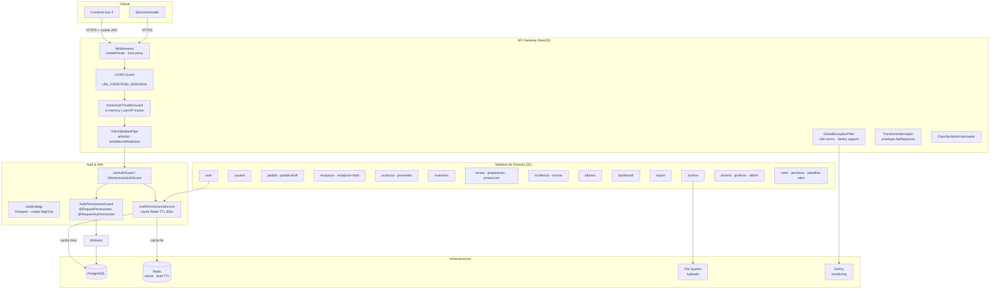
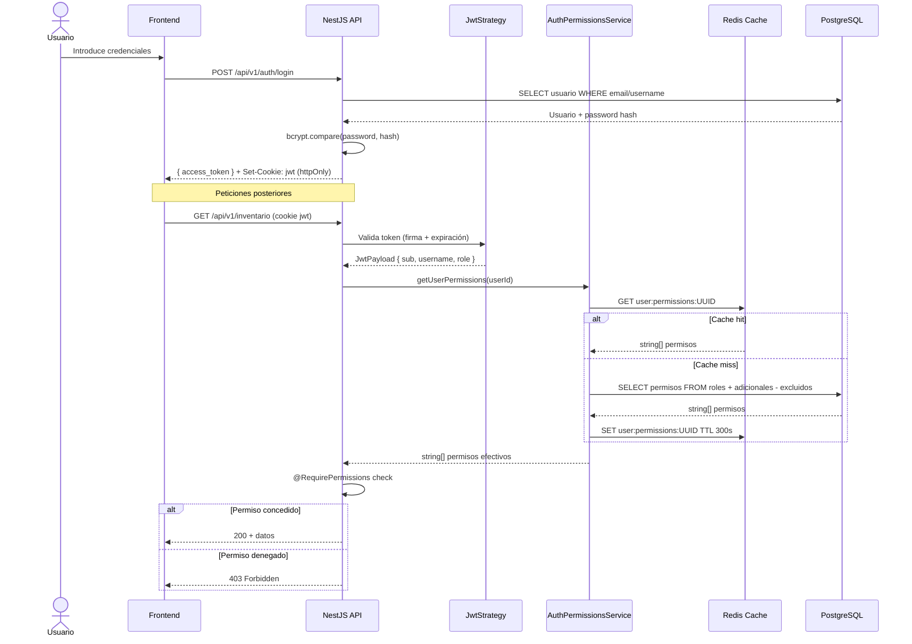
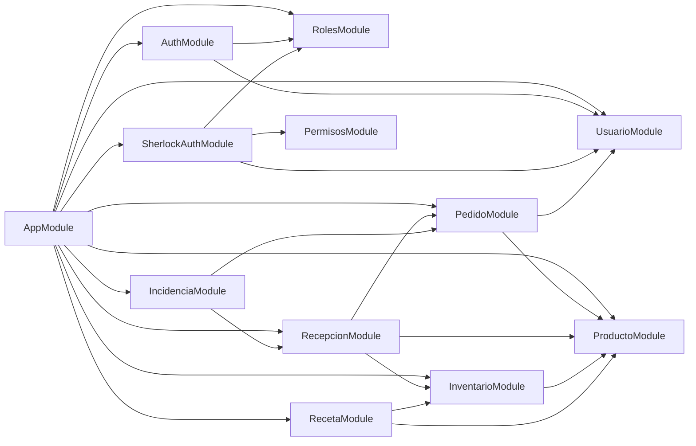

# Revisión de Arquitectura — SmartEconomat Backend

> Fecha: 23 de marzo de 2026

---

## Resumen ejecutivo

SmartEconomat Backend es una API REST construida con NestJS 11 siguiendo principios de **módulos verticales** (por dominio de negocio) combinados con una capa `common/` transversal que provee base services, repositories, guards, filters, decoradores e interceptores reutilizables. La arquitectura se apoya en un sistema de permisos dinámico (apodado "Sherlock") con cache Redis, lo que otorga flexibilidad RBAC sin penalizar rendimiento en la verificación de acceso.

---

## Diagrama de arquitectura general

---

## Diagrama de flujo de autenticación y autorización

---

## Diagrama de módulos y dependencias principales

---

## Evaluación por dimensión

### Adherencia a Clean Architecture

| Aspecto | Estado | Notas |
|---|---|---|
| Módulos verticales por dominio | Cumple | 21 módulos bien delimitados |
| Capa `common/` transversal | Cumple | Guards, filters, pipes, interceptores |
| Interfaces de repositorio | Parcial | `BaseRepository` existe; algunos repositorios extienden `Repository<T>` directamente |
| Use cases explícitos | Parcial | Existe `src/application/product/use-cases/` pero no generalizado a todos los módulos |
| DDD base entities | Cumple | `src/common/ddd/base-entity.ts`, `domain-error.ts`, `use-case.ts` presentes |

### Patrones de diseño detectados

| Patrón | Ubicación | Evaluación |
|---|---|---|
| Repository Pattern | `**/repository/*.repository.ts` | Bien aplicado, separado de servicios |
| Service Layer | `**/service/*.service.ts` | Lógica de negocio aislada del controlador |
| Data Mapper (TypeORM) | Entidades con `@Entity()` | Sin Active Record, favorece testabilidad |
| Decorator pattern | `src/common/decorators/` | Decoradores `@RequirePermissions`, `@Public`, `@Resource` |
| Command/Factory | `src/application/pedido/pedido.factory.ts` | Presente aunque limitado a un módulo |
| CQRS | — | No implementado. Podría beneficiar al módulo de inventario de alta escritura |
| Event Sourcing | — | No aplica en el estado actual del sistema |

### Inversión de dependencias (DI)

NestJS provee DI nativo. Todos los servicios, repositorios y guards se inyectan correctamente. El uso de `@Inject(CACHE_MANAGER)` y `@InjectDataSource()` es correcto y testeable.

### Gestión de módulos circulares

No se detectaron `forwardRef()` problemáticos que indiquen dependencias circulares en el núcleo del sistema. El patrón `SherlockAuthModule` importado globalmente es el de mayor solapamiento pero está bien aislado.

---

## Deuda técnica arquitectural destacada

| Área | Deuda | Impacto | Esfuerzo para resolver |
|---|---|---|---|
| Use cases | Solo un módulo tiene use cases explícitos | Bajo (hoy), Alto (a escala) | Alto |
| CQRS | Escribir y leer del mismo servicio en InventarioService | Bajo–Medio | Alto |
| Event system | No hay eventos de dominio para notificar cambios cross-módulo | Bajo (hoy) | Alto |
| Rate limiting distribuido | Throttler en memoria, no escala a múltiples instancias | Medio si se escala horizontalmente | Medio |
