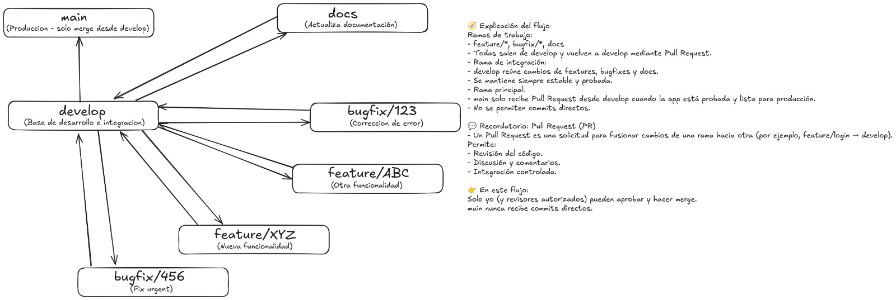

# Guía de Trabajo en Equipo — Proyecto Backend (NestJS + Git/GitHub + Docker)

## Objetivo General
Este documento establece las **normas y procedimientos de trabajo colaborativo** para el desarrollo del backend del proyecto, garantizando coherencia en la estructura, control de versiones y flujo de integración continua.  

---

## Arquitectura del Proyecto (NestJS)

El proyecto sigue una **arquitectura en capas** basada en el patrón `controller → service → repository`.  
Este enfoque permite mantener una **separación de responsabilidades**, mejor legibilidad y escalabilidad del código.

### Estructura de carpetas

La estructura actualizada del proyecto sigue una **arquitectura modular** con separación por capas dentro de cada módulo:

```bash
src/
├── main.ts                    # Punto de entrada (bootstrap, pipes, Swagger)
├── app.module.ts              # Módulo raíz
├── config/
│   ├── database.config.ts     # Configuración PostgreSQL con detección de Docker
│   ├── typeorm.config.ts      # Configuración para CLI de TypeORM
│   └── i18n.module.ts         # Configuración de internacionalización
├── common/
│   ├── dto/                   # DTOs compartidos (PaginationQuery, PaginatedResponse)
│   ├── decorators/            # Decoradores (@RequirePermissions, @Public, @Normalize)
│   ├── filters/               # GlobalExceptionFilter
│   ├── guards/                # (aplicados globalmente desde main.ts)
│   ├── interceptors/          # TransformInterceptor, CookieInterceptor
│   ├── pipes/                 # ParseUuidV7Pipe, NormalizeDataPipe
│   ├── helpers/               # MovimientoHelper, I18nHelper
│   ├── enums/                 # Enums compartidos
│   ├── constants/             # Constantes de mensajes de error
│   ├── transformers/          # TrimStringTransformer
│   └── utils/                 # EAN-13 y utilidades
├── modules/                   # 26 módulos de negocio
│   └── <modulo>/
│       ├── controller/        # Controladores HTTP + Swagger
│       ├── service/           # Lógica de negocio
│       ├── repository/        # Acceso a datos (TypeORM)
│       ├── entity/            # Definición de tablas
│       ├── dto/               # DTOs de entrada/salida
│       └── <modulo>.module.ts # Declaración del módulo
├── seeders/                   # 12 seeders para datos de desarrollo
├── i18n/                      # Traducciones (es, en)
└── migrations/                # Migraciones de base de datos
```

> Para más detalle, consulta [Arquitectura backend](../architecture/backend.md) y [Convenciones de código](convenciones.md).

---

### Explicación de carpetas y archivos

| Carpeta / Archivo | Descripción |
|--------------------|-------------|
| **main.ts** | Punto de entrada. Configura pipes globales, Swagger, filtros de excepciones y prefijo `/api/v1`. |
| **app.module.ts** | Módulo raíz que importa los módulos de negocio, configuración y TypeORM (ver `app.module.ts` para el recuento actual). |
| **config/** | Configuración de base de datos (con detección de Docker), TypeORM CLI e i18n. |
| **common/** | Elementos compartidos por todos los módulos: |
| ├── **dto/** | DTOs base: PaginationQueryDto, PaginatedResponseDto. |
| ├── **decorators/** | @RequirePermissions, @Public, @Normalize, @IsUnique, etc. |
| ├── **filters/** | GlobalExceptionFilter (mapea errores PostgreSQL a respuestas HTTP). |
| ├── **interceptors/** | TransformInterceptor para formato de respuesta estándar. |
| ├── **guards/** | Guards de autenticación y permisos (JwtAuthGuard, PermisosGuard). |
| ├── **pipes/** | ParseUuidV7Pipe, NormalizeDataPipe, NormalizeStringPipe. |
| └── **helpers/** | MovimientoHelper (trazabilidad), I18nHelper (mensajes). |
| **modules/** | Módulos de negocio. Cada uno con controller/, service/, repository/, entity/, dto/. |
| **seeders/** | Scripts para poblar la BD con datos de desarrollo (ver [seeders.md](seeders.md)). |
| **i18n/** | Archivos de traducción JSON (español e inglés). |

---

## Flujo de Trabajo con Git y GitHub

Para mantener un control de versiones limpio y ordenado, se aplicará una **estrategia basada en ramas**, siguiendo una estructura centralizada en `develop` y `main`.

### Estructura de ramas

- `main` → Rama **estable**, contiene el código de producción.  
- `develop` → Rama principal de **desarrollo**.  
- A partir de `develop` se crean las ramas secundarias:

  - `feature/<nombre>` → Nuevas funcionalidades.  
  - `bugfix/<número o descripción>` → Corrección de errores.  
  - `docs/<nombre>` → Documentación.

**Esquema visual del flujo de ramas:**  


---

## Reglas de Integración y Pull Requests

- Solo la rama **develop** puede fusionarse con **main**.  
- Todas las ramas deben crearse **a partir de develop**.  
- Cada cambio debe realizarse mediante **Pull Request (PR)**.  
- Un PR **no se considera finalizado** hasta que haya sido **revisado y aprobado**.  
- **[Responsable de integraciones]**: Darel Martínez Caballero será el encargado de unir los cambios a `develop` y `main`.

---

## Entorno de Ejecución con Docker

Todo el entorno se ejecutará mediante **Docker**, garantizando la portabilidad y homogeneidad entre entornos de desarrollo.

### Comandos básicos

```bash
# Construir y levantar los contenedores (desarrollo)
docker compose -f docker-compose.dev.yml up --build

# Levantar en segundo plano
docker compose -f docker-compose.dev.yml up -d

# Detener los contenedores
docker compose -f docker-compose.dev.yml down

# Ver logs del backend
docker compose -f docker-compose.dev.yml logs -f backend

# Producción
docker compose -f docker-compose.prod.yml up --build -d
```

> Para la configuración completa del entorno, consulta la [Guía de Inicio Rápido](../getting-started/inicio-rapido.md).

---

## 🧭 Buenas Prácticas de Equipo

- Mantener la estructura de carpetas establecida.  
- Nombrar las ramas siguiendo el formato:  
  `feature/nombre`, `bugfix/ID_descriptivo`, `docs/nombre`.  
- Escribir mensajes de commit **claros y concisos**.  
- Revisar los PR de los compañeros antes de aprobarlos.  
- Mantener sincronizado el repositorio local con `develop` antes de comenzar una nueva tarea.  

### Formato de Mensajes de Commit
Para mantener un histórico de commits legible y semántico, seguiremos el formato de **Conventional Commits**. Este enfoque utiliza prefijos para categorizar los cambios, facilita la generación automática de changelogs y ayuda en la gestión de versiones.

#### Estructura General
- **Título (primera línea)**: `<tipo>[ámbito opcional]: <descripción breve>`.
  - Limita a 50 caracteres.
  - Usa verbo en imperativo (ej. "Add", "Fix", no "Added" o "Fixed").
  - No uses punto final ni puntos suspensivos.
- **Cuerpo (opcional)**: Después de una línea en blanco, añade contexto detallado si es necesario. Usa puntuación normal aquí.
- **Pie (opcional)**: Para referencias como issues (ej. "Closes #123").

#### Tipos Comunes
- `feat`: Nueva funcionalidad para el usuario.
- `fix`: Corrección de un bug.
- `docs`: Cambios en la documentación.
- `style`: Cambios de formato (espacios, indentación) sin alterar el código.
- `refactor`: Refactorización de código sin cambiar funcionalidad.
- `perf`: Mejoras de rendimiento.
- `test`: Añadir o modificar tests.
- `build`: Cambios en el sistema de build o dependencias.
- `ci`: Cambios en la integración continua.
- `chore`: Tareas menores que no afectan al código principal.

#### Ejemplos
- `feat: add user authentication endpoint`
- `fix(users): resolve null pointer in repository`
- `docs: update README with new installation steps`
- `refactor: rename variables for better readability`

Usa `git commit` (sin `-m`) para editar el mensaje con un editor que permita múltiples líneas. Esto asegura commits atómicos y un histórico profesional.

---

📅 **Versión del documento:** 1.1  
✍️ **Responsable:** Darel Martínez Caballero