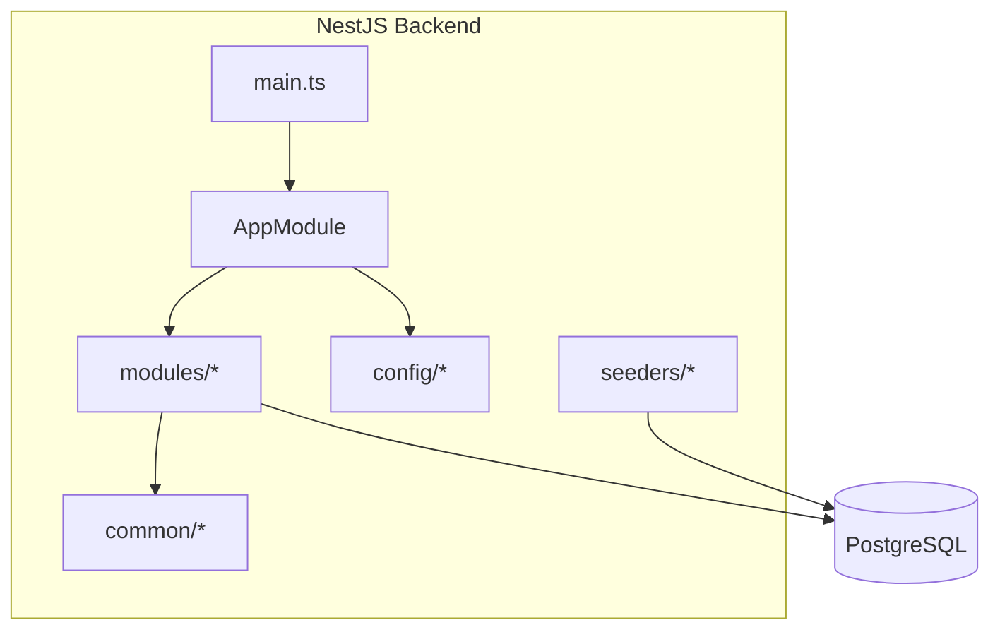
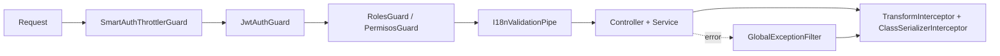
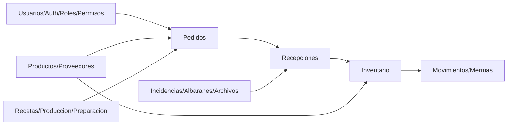

# Diagramas: Arquitectura backend

## Componentes principales

```mermaid
graph TB
  subgraph API[NestJS Backend]
    MAIN[main.ts]
    APP[AppModule]
    COMMON[common/*]
    MODS[modules/*]
    CFG[config/*]
    SEED[seeders/*]
  end

  MAIN --> APP
  APP --> MODS
  APP --> CFG
  MODS --> COMMON
  MODS --> DB[(PostgreSQL)]
  SEED --> DB
```

## Seguridad y validación

```mermaid
flowchart LR
  A[Request] --> B[SmartAuthThrottlerGuard]
  B --> C[JwtAuthGuard]
  C --> D[RolesGuard / PermisosGuard]
  D --> E[I18nValidationPipe]
  E --> F[Controller + Service]
  F --> G[TransformInterceptor + ClassSerializerInterceptor]
  F -.error.-> H[GlobalExceptionFilter]
  H --> G
```

## Mapa de dominios

```mermaid
graph LR
  U[Usuarios/Auth/Roles/Permisos] --> O[Pedidos]
  O --> R[Recepciones]
  R --> I[Inventario]
  I --> M[Movimientos/Mermas]
  P[Productos/Proveedores] --> O
  P --> I
  RC[Recetas/Produccion/Preparacion] --> O
  X[Incidencias/Albaranes/Archivos] --> R
```
