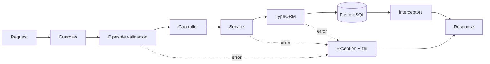

# Explicación: Flujo completo de una request

## Resumen ejecutivo
Cada petición atraviesa un pipeline con validación, seguridad, lógica de negocio, persistencia y serialización de salida. Este diseño reduce errores en borde y mantiene consistencia entre módulos.

## Etapas del flujo
1. Entrada HTTP en Express/Nest.
2. Aplicación de prefijo global `/api/v1`.
3. Resolución de guardias (throttling, auth JWT, permisos/roles).
4. Validación y transformación con `I18nValidationPipe`.
5. Ejecución del método de controller.
6. Orquestación en service (reglas de negocio).
7. Persistencia con TypeORM (repositorios/manager/queryrunner).
8. Interceptores de salida (`ClassSerializerInterceptor`, transformador).
9. Filtro global de excepciones para errores controlados/no controlados.

## ¿Qué se gana con esta secuencia?
- Seguridad por defecto en todos los módulos.
- Errores de entrada detectados antes de tocar BD.
- Respuestas homogéneas para frontend.
- Observabilidad de incidentes con request id y Sentry.

## Mapa simplificado

## Puntos críticos
- Cualquier inconsistencia de payload debe resolverse en DTO.
- Cualquier regla de dominio debe quedar en service, no en controller.
- Cualquier excepción técnica debe mapearse a error funcional entendible.
