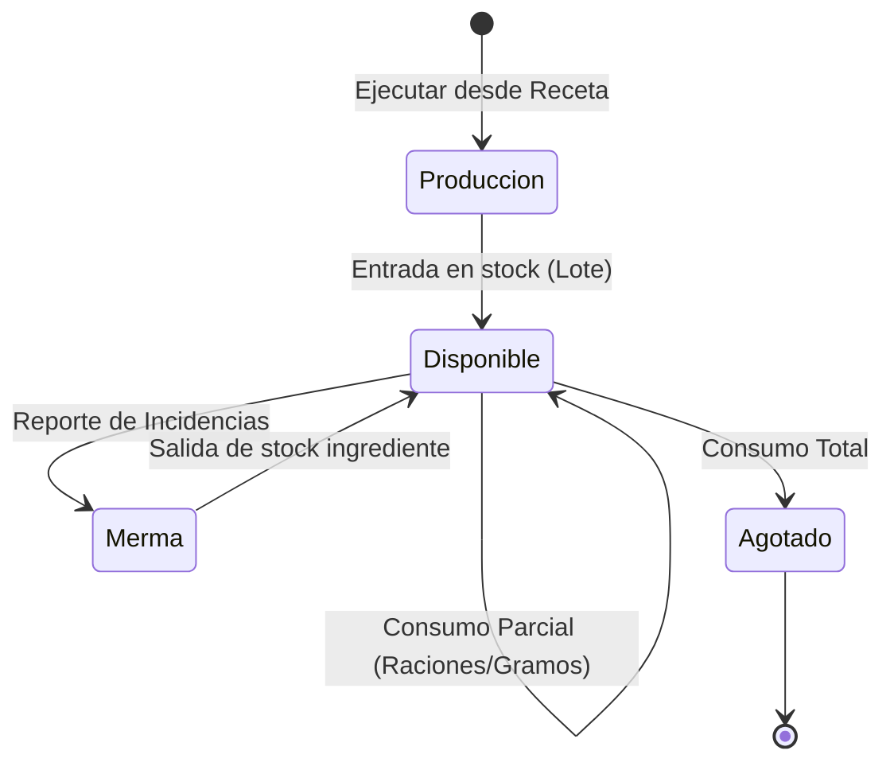

# Componentes de Preparaciones

Biblioteca de componentes para la gestión del stock elaborado (Bolsa de Preparaciones), permitiendo el seguimiento del consumo y la trazabilidad de lotes producidos.

---

## Ciclo de Vida de una Preparación

El siguiente diagrama detalla cómo fluye una elaboración desde su creación hasta su agotamiento:

---

## PreparacionesTabs

Sistema de navegación binario para separar el stock activo del histórico.

- **Ubicación**: `src/pages/Preparaciones.tsx` (Componente Interno)
- **Vistas**:
    - **Disponibles**: Lotes con porciones restantes > 0.
    - **Agotadas**: Historial de producciones que han llegado a 0 o han sido archivadas.
- **Iconografía**: Utiliza `RestaurantIcon` para el estado activo y `HistoryIcon` para el archivo, proporcionando una metáfora visual clara del "pasado y presente" de la cocina.

## ConsumoModal (Dialogo de LocalDining)

Interfaz interactiva para reducir raciones o peso del stock elaborado.

- **Ubicación**: `src/pages/Preparaciones.tsx` (Flujo de Consumo)
- **Características**:
    - **Dualidad de Medida**: Permite alternar entre consumir por "Raciones" (ej: 2.5 raciones) o por "Cantidad" (ej: 500g), realizando la conversión automática basada en la receta.
    - **Validación de Límites**: Bloquea la entrada de datos que superen el stock actual y emite alertas visuales preventivas.
    - **Incrementos Inteligentes**: Soporta pasos de `0.5` raciones, alineado con el estándar operativo de porcionado del economato.

## MermaProduccionModal

Especialización del reporte de mermas aplicado a ingredientes dentro de un lote ya producido.

- **Ubicación**: `src/pages/Preparaciones.tsx` (Flujo de Merma)
- **Propósito**: Permite descontar ingredientes específicos que se han detectado como defectuosos o perdidos *después* de que la producción ha sido completada, manteniendo la integridad del coste real.
- **Diseño**: Incluye un selector de ingredientes filtrado únicamente por los que componen la receta original del lote.

## RecipeImagePreview

Componente visual de soporte reutilizado para mostrar la identidad del plato.

- **Ubicación**: `src/pages/Recetas.tsx` (Utilizado en Preparaciones)
- **Características**: Soporta estados de carga, previsualización de imagen remota y un "Placeholder" elegante mediante el icono `MenuBookOutlined` en caso de ausencia de imagen, manteniendo la consistencia visual en las tablas de producciones.
