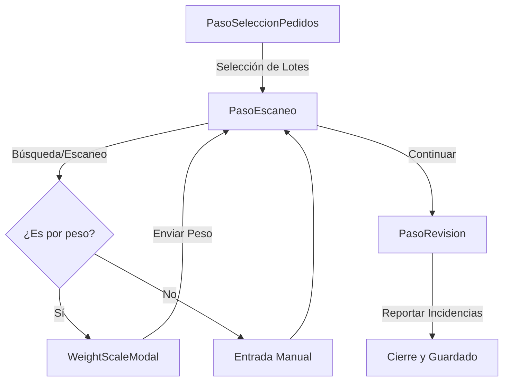

# Componentes de Recepción

Sistema de componentes críticos para la entrada de mercancía, integrando hardware (escáneres y básculas) para garantizar la precisión del stock.

---

## Diagrama de Flujo de Recepción

A continuación se detalla el flujo lógico que siguen los componentes durante una sesión de recepción:

---

## PasoEscaneo

El componente más complejo del módulo, actúa como centro de control para la entrada de productos.

- **Ubicación**: `src/components/recepcion/PasoEscaneo.tsx`
- **Características**:
    - **Búsqueda Dual**: Permite entrada manual por ID o escaneo mediante cámara/pistola via `BarcodeScanner`.
    - **Integración de Báscula**: Detecta si el producto requiere pesaje y activa dinámicamente el botón de captura de peso.
    - **Feedback Preventivo**: Los campos de albarán cambian de color (Verde/Ámbar/Azul) en tiempo real comparando la cantidad recibida con la pedida.
- **Diseño**: Utiliza un sistema de `Accordions` por proveedor para mantener el foco en la tarea actual sin saturar la pantalla con cientos de líneas de pedido.

## WeightScaleModal

Interfaz de comunicación directa con básculas digitales.

- **Ubicación**: `src/components/recepcion/WeightScaleModal.tsx`
- **Tecnología**: Utiliza la **Web Serial API** para leer datos en tiempo real de puertos COM/USB.
- **Comportamiento**:
    - **Auto-Captura**: Permite "congelar" el peso actual para enviarlo al formulario de escaneo eliminando errores de transcripción manual.
    - **Visualización de Estabilidad**: Muestra un indicador visual de conexión y actividad de datos.

## PasoRevision

Resumen analítico antes de la persistencia definitiva.

- **Ubicación**: `src/components/recepcion/PasoRevision.tsx`
- **Funcionalidad**:
    - **Detección de Desviaciones**: Calcula automáticamente las diferencias entre el albarán del proveedor y lo recibido físicamente.
    - **Generación de Incidencias**: Permite marcar líneas con problemas (roturas, defectos, faltas) que se guardarán automáticamente en el módulo de incidencias.

## RecepcionDraftConflictDialog

Sistema de seguridad para la recuperación de sesiones interrumpidas.

- **Ubicación**: `src/components/recepcion/RecepcionDraftConflictDialog.tsx`
- **Propósito**: Detecta si existe un borrador guardado localmente (IndexedDB) y pregunta al usuario si desea continuar con el trabajo previo o iniciar una recepción limpia, evitando la pérdida de horas de trabajo en caso de cierre accidental del navegador.
