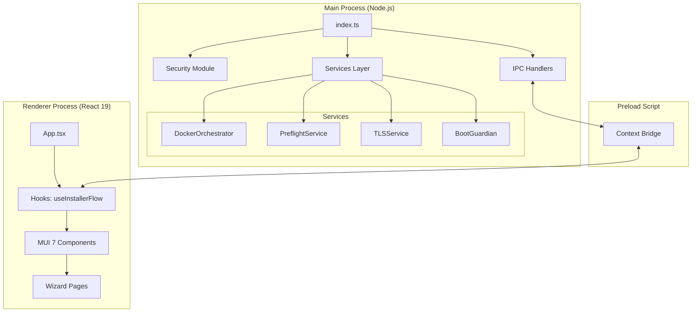

# 2. Arquitectura Global

La aplicación sigue el patrón estándar de Electron pero con una capa de abstracción de servicios muy marcada para manejar la lógica de sistema.

## Diagrama de Arquitectura

## Componentes Principales

### 1. Main Process (Cerebro)
Responsable de:
- **Elevación de privilegios**: Auto-detección y escalado vía PowerShell para gestionar Docker.
- **Orquestación**: Gestión de contenedores Docker Desktop y comandos `docker compose`.
- **Diagnóstico**: Comprobación de requisitos del sistema (WSL2, RAM, Disco, Puertos).
- **Gestión de Ventanas**: Control de la ventana principal y la ventana de depuración (Debug Console).

### 2. Renderer Process (Interfaz)
Construido con **React 19**, actúa como una máquina de estados visual que guía al usuario. No tiene acceso directo a Node.js, cumpliendo con las mejores prácticas de seguridad (`contextIsolation`).

### 3. Preload Scripts
Actúan como el puente seguro (`ContextBridge`) entre el mundo nativo y el mundo web. Solo exponen los métodos estrictamente necesarios bajo el objeto global `window.smartEconomat`.

### 4. IPC (Inter-Process Communication)
La comunicación es bidireccional y se divide en tres dominios:
- `installer`: Lógica de preflight e instalación.
- `runtime`: Gestión de servicios en ejecución (start/stop/logs).
- `debug`: Captura de logs y eventos de sistema para la consola de depuración.

### 5. Multi-window y Tray
- **Main Window**: El asistente y panel de control.
- **Debug Window**: Ventana secundaria opcional para monitoreo técnico en tiempo real.
- **System Tray**: Permite que la aplicación siga gestionando la salud de los servicios en segundo plano aunque se cierre la ventana principal.

## Ciclo de Vida
1. **Arranque**: Verifica privilegios. Si no es admin, se auto-eleva.
2. **Registro**: Inicializa servicios (Docker, TLS, Preflight).
3. **Fase de Instalación**: Ejecuta la máquina de estados del instalador.
4. **Modo Runtime**: Una vez instalado, pasa a ser un Panel de Control.
5. **Guardian**: El `BootGuardianService` monitoriza la salud de los servicios en segundo plano.
