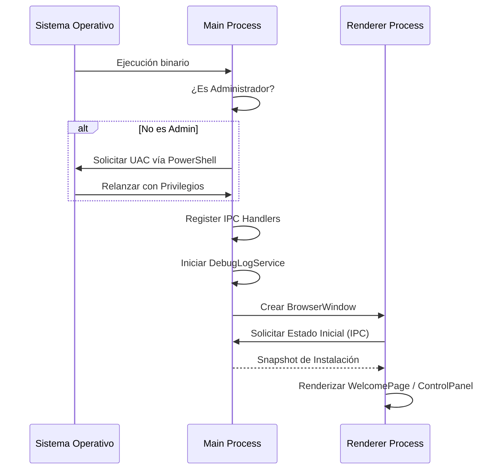

# 5. Flujo de Arranque de la Aplicación

El inicio de SmartEconomat Installer es un proceso crítico que asegura que el entorno de ejecución tenga los permisos necesarios antes de mostrar la UI.

## Proceso Paso a Paso

### 1. Verificación de Privilegios (Admin Check)
Antes de inicializar Electron, la app ejecuta una comprobación de privilegios:
- **Windows**: Ejecuta un comando ligero de sistema (`net session`) para verificar si tiene permisos de administrador.
- **Acción**: Si no es administrador, lanza un diálogo informativo y utiliza un script de **PowerShell** para re-lanzar la aplicación solicitando elevación de privilegios (UAC). Si el usuario deniega, la app se cierra.

### 2. Inicialización del Main Process
Una vez con privilegios, se ejecuta `initApp()`:
- Configura el servicio de logs (`DebugLogService`).
- Verifica el bloqueo de instancia única (`requestSingleInstanceLock`). Si ya hay una instancia abierta, enfoca la existente y se cierra.

### 3. Registro de Servicios e IPC
Se registran todos los canales de comunicación:
- `registerDebugIpc`: Para la consola de depuración.
- `registerInstallerIpc`: Para el flujo de instalación.
- `registerRuntimeIpc`: Para el control de servicios.

### 4. Creación de la Ventana Principal
Se instancia `BrowserWindow` con las siguientes configuraciones de seguridad:
- `contextIsolation: true`
- `nodeIntegration: false`
- `sandbox: false` (Necesario para ciertas operaciones de sistema de Node en el main, pero mitigado por el aislamiento).

### 5. Carga del Frontend
- Si está en **Desarrollo**: Carga desde la URL de Vite (habitualmente `http://localhost:5173`).
- Si está en **Producción**: Carga el archivo físico `index.html` desde el bundle.
- **Rutas iniciales**: Si la app se lanzó con el flag `--control-panel` (habitual al inicio del sistema), navega directamente al panel de control en lugar de al asistente.

### 6. Inicialización del Tray y Guardian
- Se crea el icono en la barra de tareas (Tray) con opciones de acceso rápido.
- Se activa el `BootGuardianService`, que realiza un check inicial de la salud de los contenedores Docker para reflejar el estado actual en la UI.

## Diagrama de Secuencia de Inicio

