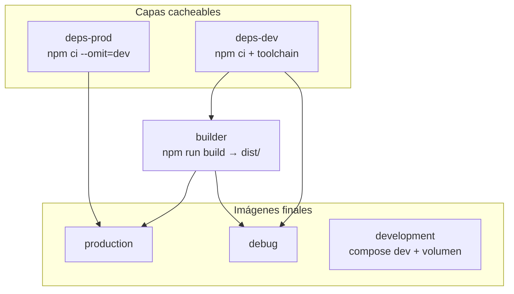

# Arquitectura Docker — Backend SmartEconomat

Documento de referencia operativa. Describe la estrategia multi-stage del backend, los targets de imagen, variables de entorno y validación.

**Fuentes en código:** `backend/Dockerfile`, `docker-compose.prod.yml`, `docker-compose.dev.yml`, `docker-compose.debug.yml`, `src/config/swagger.setup.ts`.

---

## Objetivo

Separación estricta entre:

| Modo | Imagen Docker | Swagger UI | devDependencies | TypeScript en runtime |
|------|---------------|------------|-----------------|------------------------|
| **Producción** | `target: production` | No | No | No (solo `dist/`) |
| **Debug / staging** | `target: debug` | Sí | Sí | No (usa `dist/` compilado) |
| **Desarrollo** | `target: development` | Sí | Sí (volumen) | Sí (watch) |

---

## Diagrama de stages



---

## Targets (`backend/Dockerfile`)

| Target | Descripción | Contenido principal |
|--------|-------------|---------------------|
| `deps-prod` | Capa intermedia | `package.json` + `npm ci --omit=dev` |
| `deps-dev` | Capa intermedia | `npm ci` completo + `python3` / `g++` / `make` |
| `builder` | Compilación | Código fuente + `npm run build` |
| **`production`** | **Runtime prod** | `dist/`, prod `node_modules`, scripts bootstrap, i18n, seeders JSON |
| **`debug`** | Diagnóstico | Igual que prod en código + dev `node_modules`, inspector `9229` |
| **`development`** | Hot-reload | Manifiestos + entrypoint; código montado por volumen en Compose |

### Imagen base

`node:22.13.1-bookworm-slim` (Debian bookworm, glibc):

- Compatibilidad con módulos nativos (`bcrypt`, `@sentry/profiling-node`).
- `dumb-init` como PID 1 para señales correctas.
- Alternativa Alpine descartada en prod por fricción histórica con nativos en musl.

**Requisito de engines:** `package.json` exige Node `>=22.13.0`.

---

## Política Swagger y TypeScript

### Swagger

- Controlado por `ENABLE_SWAGGER` y `NODE_ENV` en `src/config/swagger.setup.ts`.
- **Producción:** `ENABLE_SWAGGER=false` (también en `docker-compose.prod.yml`).
- Ruta cuando está activo: `http://<host>:<BACKEND_PORT>/api/v1/docs`.
- `swagger-ui-express` está en **devDependencies**; la UI no se instala en la imagen de producción.

### TypeScript

- Solo se compila en el stage `builder`.
- La imagen `production` **no incluye** el compilador ni `@nestjs/cli`.
- Puede quedar `typescript` como dependencia transitiva (~20 MB); no se usa en arranque.

---

## Variables de entorno (backend Docker)

| Variable | Producción | Debug | Desarrollo |
|----------|------------|-------|------------|
| `NODE_ENV` | `production` | `development` | `development` |
| `ENABLE_SWAGGER` | `false` | `true` | `true` |
| `LOG_LEVEL` | `info` (default) | `debug` | `debug` |

Ver inventario ampliado en [environment-variables.md](../environment-variables.md).

---

## Ficheros Docker del repositorio

| Fichero | Uso |
|---------|-----|
| `backend/Dockerfile` | Definición canónica multi-stage |
| `backend/Dockerfile.prod` | Shim de compatibilidad (ElectronInstaller, CI legado) → equivalente a `production` |
| `backend/Dockerfile.dev` | Shim → equivalente a `development` |
| `backend/smart-economat-backend/.dockerignore` | Exclusiones del contexto de build |
| `frontend/Dockerfile.prod` | Nginx + `build/` estático (sin cambio en esta estrategia) |
| `docker-compose.prod.yml` | Stack producción |
| `docker-compose.dev.yml` | Stack desarrollo |
| `docker-compose.debug.yml` | Overlay: servicio `backend-debug` (perfil `debug`) |
| `docker-compose.build.yml` | Build de imágenes para publicar |

---

## Comandos de build

```bash
# Producción
docker build -f backend/Dockerfile --target production \
  -t smarteconomat-backend:prod \
  backend/smart-economat-backend

# Debug
docker build -f backend/Dockerfile --target debug \
  -t smarteconomat-backend:debug \
  backend/smart-economat-backend

# Desarrollo (base para compose)
docker build -f backend/Dockerfile --target development \
  -t smarteconomat-backend:dev \
  backend/smart-economat-backend
```

---

## Compose por entorno

### Producción

```bash
docker compose --env-file .env.prod -f docker-compose.prod.yml up --build -d
```

- Servicio `backend` → `target: production`, imagen `smarteconomat-backend:prod`.
- **No** expone Swagger.

### Debug (staging / soporte)

Sustituye el backend de prod por `backend-debug` (no levantar ambos a la vez en el mismo puerto):

```bash
docker compose --env-file .env.prod \
  -f docker-compose.prod.yml \
  -f docker-compose.debug.yml \
  --profile debug up --build db redis backend-debug frontend
```

- Puerto API: `${BACKEND_PORT:-3000}`
- Inspector Node: `${BACKEND_DEBUG_PORT:-9229}`

### Desarrollo

```bash
docker compose --env-file .env.dev -f docker-compose.dev.yml up --build
```

- Bind-mount del código fuente.
- Volumen anónimo para `node_modules` del contenedor.
- Swagger en `http://localhost:3000/api/v1/docs`.

---

## Seguridad

| Medida | Producción |
|--------|------------|
| Usuario no root | `appuser` |
| Sin Swagger UI | Reduce superficie de ataque |
| Sin jest/eslint/erdia en imagen | `npm ci --omit=dev` |
| Sin instalación npm en arranque | Dependencias fijas en build |
| Healthcheck | `GET /api/v1` |
| Secretos | Solo vía `.env.prod` / secretos CI, nunca en imagen |

---

## Métricas orientativas

Mediciones en entorno Windows + Docker Desktop (mayo 2026, pueden variar):

| Métrica | Antes (aprox.) | Objetivo con nueva arquitectura |
|---------|----------------|----------------------------------|
| `node_modules` en contenedor prod | ~374 MB | ~250–320 MB |
| Imagen `docker images` backend prod | ~950 MB | ~350–500 MB |
| Frontend prod (nginx) | ~103 MB | Sin cambio |
| Swagger en prod | Siempre on | **Off** por defecto |

El tamaño reportado por `docker images` incluye capas compartidas con la imagen base de Node; el uso real en disco del contenedor en ejecución suele ser menor (`du` dentro del contenedor).

---

## Checklist de validación

```bash
# 1. Build
docker build -f backend/Dockerfile --target production -t smarteconomat-backend:prod-test \
  backend/smart-economat-backend

# 2. Tamaño
docker images smarteconomat-backend:prod-test

# 3. Sin paquetes de desarrollo
docker run --rm smarteconomat-backend:prod-test \
  sh -c "test ! -d node_modules/jest && test ! -d node_modules/eslint && echo OK"

# 4. Swagger desactivado (contenedor debe estar corriendo con stack prod)
docker exec smarteconomat-prod-backend-1 \
  wget -q --spider http://127.0.0.1:3000/api/v1/docs && echo FAIL || echo OK

# 5. Tests unitarios política Swagger
cd backend/smart-economat-backend && npm test -- --testPathPattern=swagger.setup
```

Script auxiliar (host): `scripts/analyze-docker-size-dev-prod.ps1`

---

## Compatibilidad e instalador

- **ElectronInstaller** sigue empaquetando `backend/Dockerfile.prod` (shim alineado con `production`).
- Preferir en desarrollo nuevo: `docker build -f backend/Dockerfile --target <nombre>`.

---

## Documentación relacionada

- [How-to: construir y desplegar imágenes backend](../how-to/docker-backend-imagenes.md)
- [Explicación: por qué esta estrategia](../explanation/estrategia-imagenes-docker-backend.md)
- [Instalación](../installation.md)
- [Despliegue](../deployment.md)
- [Configurar producción Docker](../how-to/configurar-produccion-docker.md)
- [Troubleshooting Docker](../operations/troubleshooting/README.md)
