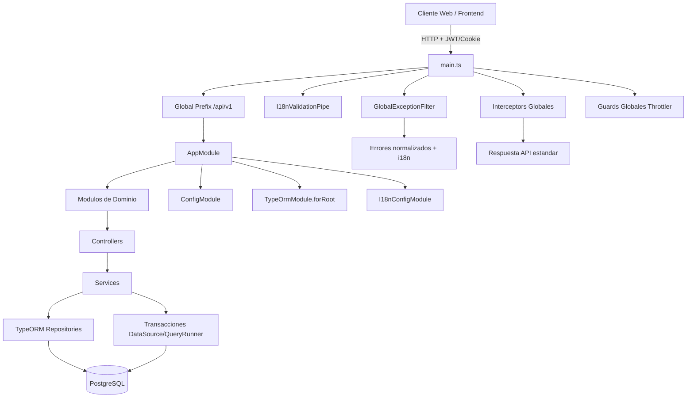
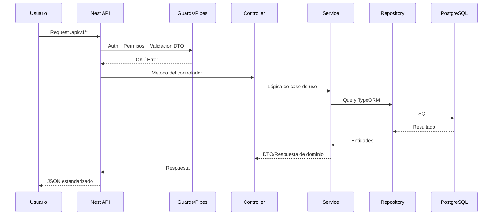

# Backend SmartEconomat (NestJS + TypeORM) - Overview

## Objetivo
Este documento resume la arquitectura, organización y flujo principal del backend de SmartEconomat para facilitar onboarding, operación y evolución del sistema.

## Stack técnico
- NestJS 11
- TypeORM 0.3.x
- PostgreSQL
- class-validator + class-transformer
- JWT (passport-jwt)
- nestjs-i18n
- @nestjs/throttler
- Sentry

## Arquitectura general

## Flujo request-response

## Estilo arquitectónico adoptado
El backend sigue una arquitectura modular por dominio sobre NestJS con separación en capas:
- Capa HTTP: controllers + decorators + DTO de entrada
- Capa de aplicación: services con reglas de negocio
- Capa de persistencia: repositories TypeORM + entidades
- Infraestructura transversal: guards, pipes, filtros, interceptors, i18n, throttling, logging

Esta aproximación prioriza:
- Alta cohesión por módulo
- Reutilización de infraestructura común
- Escalado horizontal por dominios
- Mantenibilidad para equipos múltiples

## Estructura de carpetas (resumen)
- `backend/smart-economat-backend/src/main.ts`: bootstrap global
- `backend/smart-economat-backend/src/app.module.ts`: composición de módulos
- `backend/smart-economat-backend/src/config/`: database, i18n y configuración
- `backend/smart-economat-backend/src/common/`: infraestructura compartida
- `backend/smart-economat-backend/src/modules/`: módulos de negocio
- `backend/smart-economat-backend/src/seeders/`: carga de datos
- `backend/smart-economat-backend/test/`: tests unit/e2e

## Documentos relacionados
- [Arquitectura detallada](./architecture/backend-nestjs-typeorm.md)
- [Patrones y trade-offs](./architecture/patrones-y-tradeoffs.md)
- [Tutorial de arranque](./tutorials/levantar-proyecto-desde-cero.md)
- [Referencia de endpoints](./reference/endpoints.md)
- [Referencia de entidades](./reference/entidades.md)
