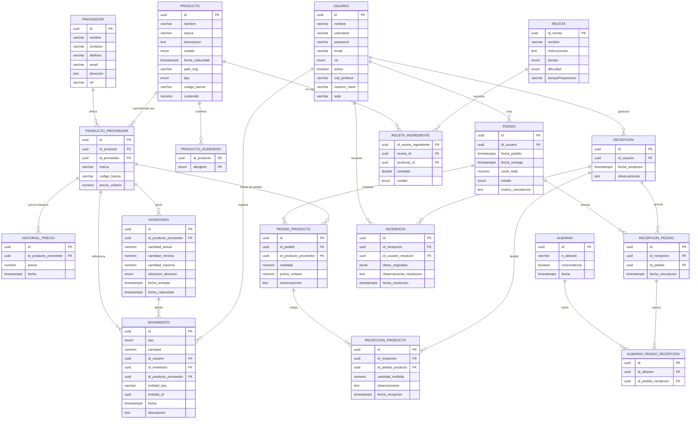

# 📦 Modelo Entidad-Relación — SmartEconomat

> Documento generado a partir del código fuente TypeScript (TypeORM). Refleja el estado actual de todas las entidades del backend.

---

## 🧩 Descripción General

Sistema de gestión de almacén y economato para un centro educativo de cocina. Gestiona **productos, proveedores, pedidos, recepciones, inventario, albaranes, movimientos, incidencias y recetas**, garantizando trazabilidad total de alimentos (lotes, fechas de caducidad) y preparado para inspecciones sanitarias.

---

## 🏗️ Base Común — `BaseEntity` (abstracta)

Todas las entidades (salvo `ProductoAlergeno`, `Receta` y `RecetaIngrediente` que usan composite PK propia) **heredan** los siguientes campos:

| Campo | Tipo | Descripción |
|---|---|---|
| `id` | `uuid` PK | UUID v7, generado en BD (`uuid_generate_v7()`), ordenado temporalmente |
| `created_at` | `timestamptz` | Fecha/hora de creación (automática) |
| `updated_at` | `timestamptz` | Fecha/hora de última actualización (automática) |
| `deleted_at` | `timestamptz` (nullable) | Soft delete — `NULL` = activo, valor = eliminado |
| `deleted_by` | `uuid` (nullable) | UUID del usuario que realizó el borrado lógico |
| `version` | `integer` | Versión optimista para prevenir race conditions (auto-incremental) |

---

## 📘 Catálogo de Entidades

---

### 👤 `usuario`

Representa a los usuarios del sistema con sus credenciales y rol.

| Campo | Tipo / Enum | Restricciones | Descripción |
|---|---|---|---|
| `id` | `uuid` | PK | Heredado de BaseEntity |
| `nombre` | `varchar(100)` | NOT NULL | Nombre completo |
| `username` | `varchar(100)` | UNIQUE, NOT NULL | Nombre de usuario para login |
| `password` | `varchar(100)` | NOT NULL, `select:false` | Hash bcrypt (nunca texto plano) |
| `email` | `varchar(255)` | UNIQUE, NOT NULL | Correo electrónico |
| `rol` | `enum rolUsuario` | NOT NULL, default `alumno` | `admin` · `profesor` · `alumno` |
| `activo` | `boolean` | NOT NULL, default `true` | Acceso habilitado/deshabilitado |
| `cial_profesor` | `varchar(100)` | UNIQUE, nullable | Código de identificación del profesor |
| `numero_clase` | `varchar(10)` | nullable | Número de clase asignado |
| `aula` | `varchar(50)` | nullable | Aula asignada |

**Índices:** `idx_usuario_username`, `idx_usuario_email`, `idx_usuario_activo`

**Relaciones salientes:**
- `pedidos` → `Pedido[]` (OneToMany)
- `recepciones` → `Recepcion[]` (OneToMany)
- `movimientos` → `Movimiento[]` (OneToMany)
- `incidenciasResueltas` → `Incidencia[]` (OneToMany)

---

### 🧱 `producto`

Ficha técnica base de un producto, independiente del proveedor.

| Campo | Tipo / Enum | Restricciones | Descripción |
|---|---|---|---|
| `id` | `uuid` | PK | Heredado de BaseEntity |
| `nombre` | `varchar(100)` | NOT NULL | Nombre comercial |
| `marca` | `varchar(100)` | nullable | Marca o fabricante |
| `descripcion` | `text` | nullable | Descripción detallada / ingredientes |
| `unidad` | `enum UnidadProducto` | nullable | `kg` · `g` · `l` · `ml` · `unidad` · `paq` |
| `fecha_caducidad` | `timestamptz` | nullable | CHECK: debe ser > `created_at` |
| `path_img` | `varchar(200)` | nullable | Ruta o URL de imagen |
| `tipo` | `enum TipoProducto` | nullable | `verdura` · `fruta` · `carne` · `pescado` · `marisco` · `lacteo` · `huevo` · `cereal` · `legumbre` · `fruto_seco` · `condimento` · `aceite` · `azucar` · `bebida` · `otro` |
| `codigo_barras` | `varchar(50)` | UNIQUE, nullable | Código EAN/UPC global del producto |
| `contenido` | `numeric(10,2)` | NOT NULL, default `0` | Cantidad numérica del producto (junto a `unidad` define el tamaño) |

**Índices:** `idx_producto_nombre`, `idx_producto_codigo_barras`

**Relaciones salientes:**
- `alergenos` → `ProductoAlergeno[]` (OneToMany, cascade)
- `proveedores` → `ProductoProveedor[]` (OneToMany)

---

### 🏭 `proveedor`

Empresa o persona que suministra productos.

| Campo | Tipo | Restricciones | Descripción |
|---|---|---|---|
| `id` | `uuid` | PK | Heredado de BaseEntity |
| `nombre` | `varchar(100)` | NOT NULL | Nombre del proveedor |
| `contacto` | `varchar(100)` | nullable | Nombre de persona de contacto |
| `telefono` | `varchar(50)` | nullable | Teléfono |
| `email` | `varchar(255)` | nullable | Email de contacto |
| `direccion` | `text` | nullable | Dirección postal |
| `nif` | `varchar(20)` | UNIQUE, nullable | NIF/CIF del proveedor |

**Índices:** `idx_proveedor_nombre`, `idx_proveedor_nif`

**Relaciones salientes:**
- `productos` → `ProductoProveedor[]` (OneToMany)

---

### 🔗 `producto_proveedor`

Relación entre un Producto y un Proveedor. Aggregate root del suministro, stock y precios.

| Campo | Tipo | Restricciones | Descripción |
|---|---|---|---|
| `id` | `uuid` | PK | Heredado de BaseEntity |
| `id_producto` | `uuid` | FK → `producto.id`, RESTRICT | Producto base |
| `id_proveedor` | `uuid` | FK → `proveedor.id`, RESTRICT | Proveedor |
| `marca` | `varchar(100)` | nullable | Marca específica del proveedor (puede diferir del producto) |
| `codigo_barras` | `varchar(130)` | nullable | Código de barras del proveedor |
| `precio_unitario` | `numeric(10,2)` | nullable, CHECK ≥ 0 | Precio unitario actual pactado |

**Restricciones:** UNIQUE(`producto`, `proveedor`), CHECK `precio_unitario >= 0`

**Índices:** `idx_producto_proveedor_producto`, `idx_producto_proveedor_proveedor`

**Relaciones salientes:**
- `inventarios` → `Inventario[]` (OneToMany)
- `historialPrecios` → `HistorialPrecio[]` (OneToMany)
- `pedidoProductos` → `PedidoProducto[]` (OneToMany)

---

### 🌿 `producto_alergeno`

Tabla puente entre Producto y alérgenos (clave primaria compuesta, no hereda BaseEntity).

| Campo | Tipo / Enum | Restricciones | Descripción |
|---|---|---|---|
| `id_producto` | `uuid` | PK (compuesta), FK → `producto.id` CASCADE | Producto al que pertenece |
| `alergeno` | `enum AlergenoProducto` | PK (compuesta) | `gluten` · `crustaceos` · `huevos` · `pescado` · `cacahuetes` · `soja` · `lacteos` · `frutos_con_cascara` · `apio` · `mostaza` · `sesamo` · `sulfito` · `altramuces` · `moluscos` |
| `created_at` | `timestamptz` | automático | |
| `updated_at` | `timestamptz` | automático | |
| `deleted_at` | `timestamptz` | nullable | Soft delete |
| `version` | `integer` | versionado optimista | |

---

### 💰 `historial_precio`

Registro histórico de cambios de precio de un `ProductoProveedor`.

| Campo | Tipo | Restricciones | Descripción |
|---|---|---|---|
| `id` | `uuid` | PK | Heredado de BaseEntity |
| `id_producto_proveedor` | `uuid` | FK → `producto_proveedor.id`, CASCADE | Relación principal |
| `precio` | `numeric(10,2)` | NOT NULL, CHECK ≥ 0 | Precio en vigor en ese momento |
| `fecha` | `timestamptz` | NOT NULL, default `NOW()` | Fecha de registro/entrada en vigor |

**Índices:** `idx_historial_precio_producto_proveedor`, `idx_historial_precio_fecha`

---

### 📦 `inventario`

Stock físico de un `ProductoProveedor` en una ubicación concreta. Soporta FEFO (First Expired, First Out).

| Campo | Tipo / Enum | Restricciones | Descripción |
|---|---|---|---|
| `id` | `uuid` | PK | Heredado de BaseEntity |
| `id_producto_proveedor` | `uuid` | FK → `producto_proveedor.id`, RESTRICT | Producto y proveedor del lote |
| `cantidad_actual` | `numeric(12,3)` | NOT NULL, CHECK ≥ 0 | Stock disponible en esta ubicación |
| `cantidad_minima` | `numeric(12,3)` | NOT NULL, CHECK ≥ 0 | Stock de seguridad / punto de pedido |
| `cantidad_maxima` | `numeric(12,3)` | nullable, CHECK ≥ `cantidad_minima` | Capacidad máxima de almacenamiento |
| `ubicacion_almacen` | `enum localInventario` | NOT NULL | `Almacen A` · `Frigorifico A` · `Bodega A` · `Almacen B` · `Frigorifico B` · `Bodega B` |
| `fecha_entrada` | `timestamptz` | NOT NULL, default `NOW()` | Fecha de entrada del lote |
| `fecha_caducidad` | `timestamptz` | NOT NULL | Fecha de caducidad del lote (FEFO) |

**Índices:** `idx_inventario_producto_proveedor`, `idx_inventario_ubicacion`, `idx_inventario_fecha_caducidad`, `idx_inventario_ubicacion_caducidad`

---

### 🧾 `pedido`

Solicitud de compra de productos a proveedores.

| Campo | Tipo / Enum | Restricciones | Descripción |
|---|---|---|---|
| `id` | `uuid` | PK | Heredado de BaseEntity |
| `id_usuario` | `uuid` | FK → `usuario.id`, SET NULL, nullable | Usuario que creó el pedido |
| `fecha_pedido` | `timestamptz` | NOT NULL, default `NOW()` | Fecha de creación |
| `fecha_entrega` | `timestamptz` | nullable | Fecha esperada o real de entrega |
| `coste_total` | `numeric(14,4)` | NOT NULL, default `0`, CHECK ≥ 0 | Coste total (suma de líneas) |
| `estado` | `enum EstadoPedido` | NOT NULL, default `pendiente` | Ver flujo de estados más abajo |
| `motivo_cancelacion` | `text` | nullable | Motivo si `estado = CANCELADO` |

**Estados (`EstadoPedido`):** `pendiente` → `en_proceso` → `recibido` / `incidencia` / `parcial` / `cancelado`

**Índices:** `idx_pedido_estado`, `idx_pedido_fecha`, `idx_pedido_usuario`, `idx_pedido_estado_created`

**Relaciones salientes:**
- `pedidoProductos` → `PedidoProducto[]` (OneToMany, cascade)
- `recepcionesPedido` → `RecepcionPedido[]` (OneToMany)

---

### 📋 `pedido_producto`

Línea de detalle de un pedido: producto, cantidad y precio histórico.

| Campo | Tipo | Restricciones | Descripción |
|---|---|---|---|
| `id` | `uuid` | PK | Heredado de BaseEntity |
| `id_pedido` | `uuid` | FK → `pedido.id`, RESTRICT | Pedido al que pertenece |
| `id_producto_proveedor` | `uuid` | FK → `producto_proveedor.id`, RESTRICT | Producto + proveedor solicitado |
| `cantidad` | `numeric(12,3)` | NOT NULL, CHECK > 0 | Cantidad solicitada |
| `precio_unitario` | `numeric(12,4)` | NOT NULL, CHECK ≥ 0 | Precio congelado en el momento del pedido |
| `observaciones` | `text` | nullable | Observaciones de la línea |

**Índices:** `idx_pedido_producto_pedido`, `idx_pedido_producto_producto_proveedor`

---

### 📥 `recepcion`

Acto de recepción de mercancía en el almacén. Aggregate root de la entrada de stock.

| Campo | Tipo | Restricciones | Descripción |
|---|---|---|---|
| `id` | `uuid` | PK | Heredado de BaseEntity |
| `id_usuario` | `uuid` | FK → `usuario.id`, SET NULL, nullable | Responsable de la recepción |
| `fecha_recepcion` | `timestamptz` | NOT NULL, default `NOW()` | Fecha y hora de recepción |
| `observaciones` | `text` | nullable | Notas generales (ej: "cajas golpeadas") |

**Índices:** `idx_recepcion_usuario`, `idx_recepcion_fecha`

**Relaciones salientes:**
- `recepcionesPedidos` → `RecepcionPedido[]` (OneToMany, cascade)
- `recepcionProductos` → `RecepcionProducto[]` (OneToMany, cascade)

---

### 🔗 `recepcion_pedido`

Tabla puente entre `Recepcion` y `Pedido` (N:M). Un pedido puede recepcionarse parcialmente en varias recepciones.

| Campo | Tipo | Restricciones | Descripción |
|---|---|---|---|
| `id` | `uuid` | PK | Heredado de BaseEntity |
| `id_recepcion` | `uuid` | FK → `recepcion.id`, RESTRICT | Recepción |
| `id_pedido` | `uuid` | FK → `pedido.id`, RESTRICT | Pedido vinculado |
| `fecha_vinculacion` | `timestamptz` | NOT NULL, default `NOW()` | Fecha en que se vincularon |

**Restricciones:** UNIQUE(`recepcion`, `pedido`)

**Índices:** `idx_recepcion_pedido_recepcion`, `idx_recepcion_pedido_pedido`

**Relaciones salientes:**
- `albaranPedidoRecepcion` → `AlbaranPedidoRecepcion[]` (OneToMany)

---

### 📦 `recepcion_producto`

Detalle de los productos efectivamente recibidos en una recepción, cotejando contra la línea de pedido original.

| Campo | Tipo | Restricciones | Descripción |
|---|---|---|---|
| `id` | `uuid` | PK | Heredado de BaseEntity |
| `id_recepcion` | `uuid` | FK → `recepcion.id`, CASCADE | Recepción cabecera |
| `id_pedido_producto` | `uuid` | FK → `pedido_producto.id`, RESTRICT | Línea de pedido original |
| `cantidad_recibida` | `numeric(12,3)` | NOT NULL, CHECK ≥ 0 | Cantidad realmente recibida |
| `observaciones` | `text` | nullable | Observaciones sobre este producto |
| `fecha_recepcion` | `timestamptz` | NOT NULL, default `NOW()` | Fecha exacta de recepción del ítem |

**Índices:** `idx_recepcion_producto_recepcion`, `idx_recepcion_producto_pedido_producto`

---

### 📄 `albaran`

Documento de entrega emitido por el proveedor.

| Campo | Tipo | Restricciones | Descripción |
|---|---|---|---|
| `id` | `uuid` | PK | Heredado de BaseEntity |
| `n_albaran` | `varchar(50)` | UNIQUE, NOT NULL | Número de albarán del proveedor |
| `concordancia` | `boolean` | nullable | Indica si el albarán concuerda con lo pedido |
| `fecha` | `timestamptz` | nullable | Fecha del albarán |

**Índices:** `idx_albaran_n_albaran`, `idx_albaran_fecha`

**Relaciones salientes:**
- `albaranPedidoRecepcion` → `AlbaranPedidoRecepcion[]` (OneToMany)

---

### 🔗 `albaran_pedido_recepcion`

Tabla puente entre `Albaran` y `RecepcionPedido` (N:M).

| Campo | Tipo | Restricciones | Descripción |
|---|---|---|---|
| `id` | `uuid` | PK | Heredado de BaseEntity |
| `id_albaran` | `uuid` | FK → `albaran.id`, CASCADE | Albarán |
| `id_pedido_recepcion` | `uuid` | FK → `recepcion_pedido.id`, CASCADE | Vínculo recepción-pedido |

**Índices:** `idx_albaran_pedido_recepcion_albaran`, `idx_albaran_pedido_recepcion_recepcion_pedido`

---

### 🔄 `movimiento`

Registro de cada transacción de cambio en el inventario. Implementa trazabilidad polimórfica.

| Campo | Tipo / Enum | Restricciones | Descripción |
|---|---|---|---|
| `id` | `uuid` | PK | Heredado de BaseEntity |
| `tipo` | `enum TipoMovimiento` | NOT NULL | `entrada` · `salida` · `ajuste` · `pedido` · `entrada_compra` |
| `cantidad` | `numeric(12,3)` | NOT NULL, CHECK ≥ 0 | Cantidad movida (siempre positiva; la dirección la determina `tipo`) |
| `id_usuario` | `uuid` | FK → `usuario.id`, SET NULL, nullable | Usuario que realizó/autorizó el movimiento |
| `id_inventario` | `uuid` | FK → `inventario.id`, SET NULL, nullable | Lote de inventario afectado |
| `id_producto_proveedor` | `uuid` | FK → `producto_proveedor.id`, SET NULL, nullable | Producto+proveedor asociado (desnormalizado para rendimiento) |
| `entidad_tipo` | `varchar(50)` | NOT NULL | Tipo de entidad origen: `'Recepcion'`, `'Pedido'`, `'AjusteManual'` |
| `entidad_id` | `uuid` | NOT NULL | ID de la entidad origen (polimorfismo referencial) |
| `fecha` | `timestamptz` | NOT NULL, default `NOW()` | Fecha y hora exacta del movimiento |
| `descripcion` | `text` | nullable | Justificación o descripción del movimiento |

**Índices:** `idx_movimiento_tipo`, `idx_movimiento_fecha`, `idx_movimiento_usuario`, `idx_movimiento_entidad_tipo`, `idx_movimiento_entidad_id`, `idx_movimiento_polimorfico`, `idx_movimiento_inventario`, `idx_movimiento_producto_proveedor`

---

### ⚠️ `incidencia`

Problema o discrepancia detectada durante la recepción. Almacena una copia JSONB inmutable para auditoría.

| Campo | Tipo | Restricciones | Descripción |
|---|---|---|---|
| `id` | `uuid` | PK | Heredado de BaseEntity |
| `id_recepcion` | `uuid` | FK → `recepcion.id`, CASCADE, NOT NULL | Recepción donde se generó |
| `id_usuario_resolutor` | `uuid` | FK → `usuario.id`, SET NULL, nullable | Usuario que resolvió la incidencia |
| `datos_originales` | `jsonb` | NOT NULL | Snapshot inmutable de discrepancias (ver estructura abajo) |
| `observaciones_resolucion` | `text` | nullable | Notas sobre la resolución |
| `fecha_resolucion` | `timestamptz` | nullable | `NULL` = pendiente; valor = resuelta |

**Estructura del campo `datos_originales` (JSONB):**
```json
{
  "productos": [
    {
      "idPedidoProducto": "uuid",
      "cantidadPedida": 10,
      "cantidadRecibida": 8,
      "diferencia": -2,
      "observaciones": "opcional"
    }
  ],
  "observacionesRecepcion": "opcional"
}
```

**Índices:** `idx_incidencia_recepcion`, `idx_incidencia_usuario_resolutor`

---

### 🍳 `receta`

Receta culinaria del centro educativo (no hereda BaseEntity — PK propia).

| Campo | Tipo / Enum | Restricciones | Descripción |
|---|---|---|---|
| `id_receta` | `uuid` | PK, default `uuid_generate_v7()` | Identificador |
| `nombre` | `varchar(150)` | NOT NULL | Nombre de la receta |
| `instrucciones` | `text` | NOT NULL | Pasos de elaboración |
| `tiempo` | `enum TiempoReceta` | NOT NULL | `10 min` · `20 min` · `30 min` · `45 min` · `60 min` |
| `dificultad` | `enum DificultadReceta` | NOT NULL | `Fácil` · `Media` · `Difícil` |
| `tiempoPreparacion` | `varchar(50)` | NOT NULL | Tiempo de preparación (texto libre, ej: "15 min") |

**Índice compuesto:** (`dificultad`, `tiempo`)

**Relaciones salientes:**
- `ingredientes` → `RecetaIngrediente[]` (OneToMany)

---

### 🥕 `receta_ingrediente`

Ingredientes de una receta con sus cantidades y unidades (no hereda BaseEntity — PK propia).

| Campo | Tipo / Enum | Restricciones | Descripción |
|---|---|---|---|
| `id_receta_ingrediente` | `uuid` | PK, default `uuid_generate_v7()` | Identificador |
| `receta_id` | `uuid` | FK → `receta.id_receta`, CASCADE | Receta a la que pertenece |
| `producto_id` | `uuid` | FK → `producto.id`, RESTRICT | Producto usado como ingrediente |
| `cantidad` | `double precision` | NOT NULL | Cantidad del ingrediente |
| `unidad` | `enum UnidadIngrediente` | NOT NULL | `g` · `kg` · `l` · `ml` · `pieza` · `cda` · `cdta` |

---

## 📊 Tabla de Relaciones y Cardinalidades

| Entidad A | Entidad B | Cardinalidad | Tabla puente / FK | onDelete | Descripción |
|---|---|---|---|---|---|
| `Producto` | `ProductoProveedor` | **1:N** | FK en `producto_proveedor` | RESTRICT | Un producto puede tener N proveedores |
| `Proveedor` | `ProductoProveedor` | **1:N** | FK en `producto_proveedor` | RESTRICT | Un proveedor oferece N productos |
| `Producto` | `ProductoAlergeno` | **1:N** | FK en `producto_alergeno` | CASCADE | Un producto tiene N alérgenos |
| `ProductoProveedor` | `Inventario` | **1:N** | FK en `inventario` | RESTRICT | Un producto-proveedor tiene N lotes en stock |
| `ProductoProveedor` | `HistorialPrecio` | **1:N** | FK en `historial_precio` | CASCADE | Un producto-proveedor tiene N registros de precio |
| `ProductoProveedor` | `PedidoProducto` | **1:N** | FK en `pedido_producto` | RESTRICT | Un producto-proveedor aparece en N líneas de pedido |
| `Usuario` | `Pedido` | **1:N** | FK en `pedido` | SET NULL | Un usuario crea N pedidos |
| `Pedido` | `PedidoProducto` | **1:N** | FK en `pedido_producto` | RESTRICT | Un pedido tiene N líneas de producto |
| `Usuario` | `Recepcion` | **1:N** | FK en `recepcion` | SET NULL | Un usuario gestiona N recepciones |
| `Recepcion` | `RecepcionPedido` | **N:M** | `recepcion_pedido` | RESTRICT | Varios pedidos ↔ varias recepciones |
| `Pedido` | `RecepcionPedido` | **N:M** | `recepcion_pedido` | RESTRICT | (tabla puente) |
| `RecepcionPedido` | `AlbaranPedidoRecepcion` | **N:M** | `albaran_pedido_recepcion` | CASCADE | Una recepción-pedido ↔ varios albaranes |
| `Albaran` | `AlbaranPedidoRecepcion` | **N:M** | `albaran_pedido_recepcion` | CASCADE | (tabla puente) |
| `Recepcion` | `RecepcionProducto` | **1:N** | FK en `recepcion_producto` | CASCADE | Una recepción tiene N líneas de producto recibido |
| `PedidoProducto` | `RecepcionProducto` | **1:N** | FK en `recepcion_producto` | RESTRICT | Cotejar pedido vs. recibido por línea |
| `Recepcion` | `Incidencia` | **1:N** | FK en `incidencia` | CASCADE | Una recepción puede generar N incidencias |
| `Usuario` | `Incidencia` | **1:N** | FK en `incidencia` | SET NULL | Un usuario resuelve N incidencias |
| `Usuario` | `Movimiento` | **1:N** | FK en `movimiento` | SET NULL | Un usuario registra N movimientos |
| `Inventario` | `Movimiento` | **1:N** | FK en `movimiento` | SET NULL | Un lote de inventario tiene N movimientos |
| `ProductoProveedor` | `Movimiento` | **1:N** | FK en `movimiento` | SET NULL | Desnormalización para consultas rápidas |
| `Receta` | `RecetaIngrediente` | **1:N** | FK en `receta_ingrediente` | CASCADE | Una receta tiene N ingredientes |
| `Producto` | `RecetaIngrediente` | **1:N** | FK en `receta_ingrediente` | RESTRICT | Un producto es ingrediente en N recetas |

---

## 🗺️ Diagrama Mermaid



---

## 🔐 Convenciones de Integridad

| Patrón | Aplicación |
|---|---|
| **Soft delete** | Todas las entidades (vía `deleted_at` / `deleted_by` de BaseEntity) |
| **Optimistic locking** | Todas las entidades (vía `version` de BaseEntity) |
| **ON DELETE RESTRICT** | Relaciones con datos históricos que no deben eliminarse (pedidos, inventario) |
| **ON DELETE CASCADE** | Relaciones de dependencia fuerte (líneas → cabecera, albarán → detalle) |
| **ON DELETE SET NULL** | Relaciones donde se preserva el histórico aunque se borre el relacionado (usuario) |
| **UUID v7** | PKs temporalmente ordenables, generadas en BD |
| **CHECK constraints** | Importes ≥ 0, cantidades > 0, fechas coherentes |
| **Índices compuestos** | Combinaciones frecuentes en filtros (estado+fecha, ubicación+caducidad) |
| **JSONB inmutable** | Snapshots de auditoría en `Incidencia.datos_originales` |

---


