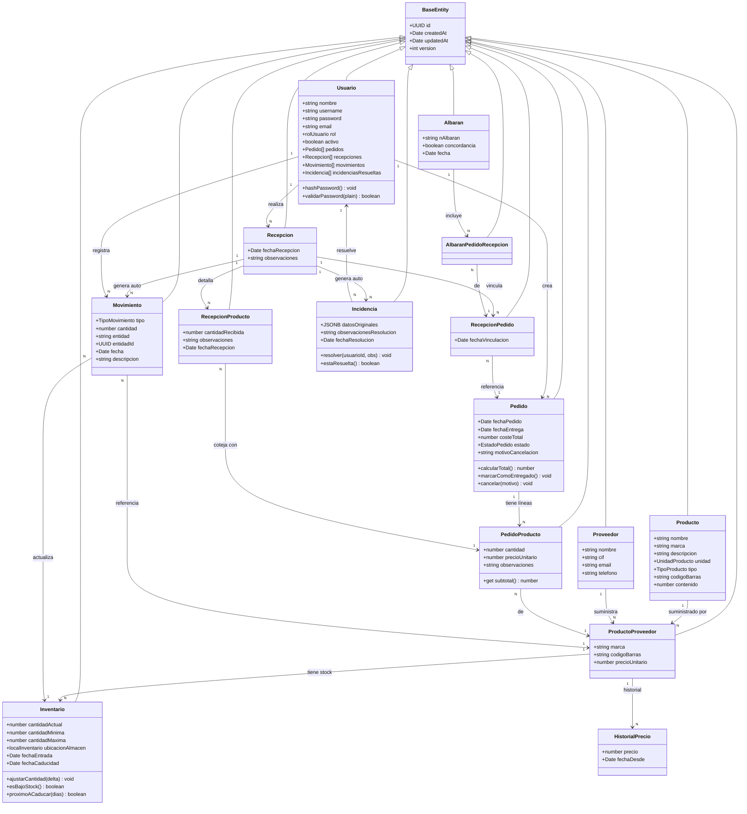
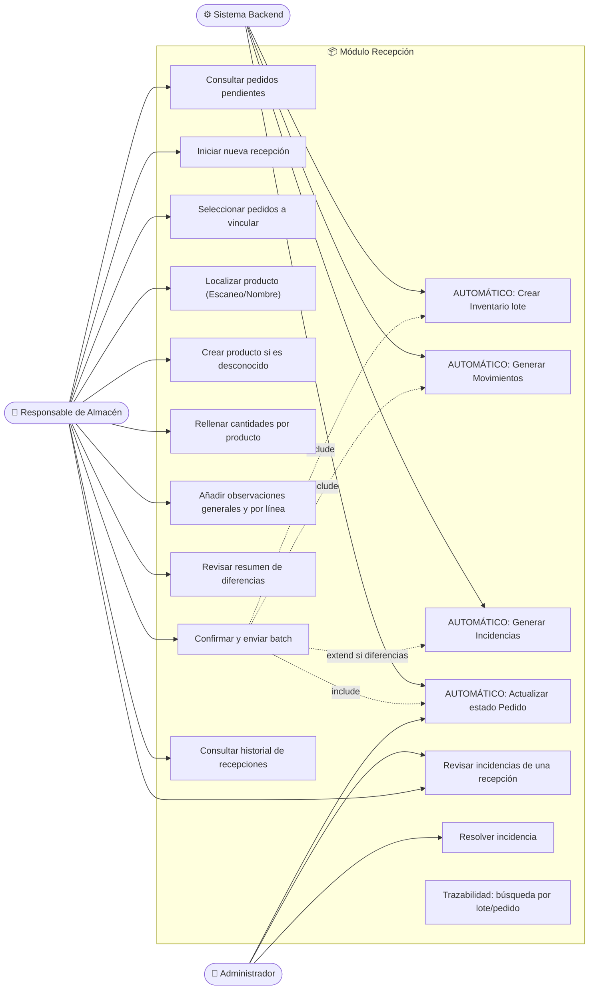
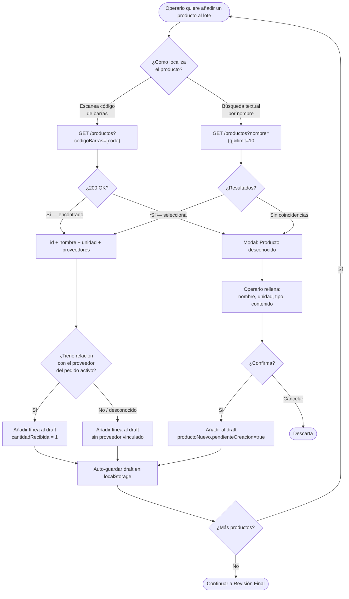
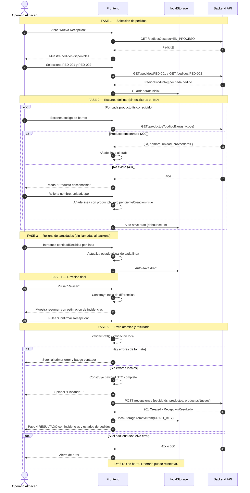
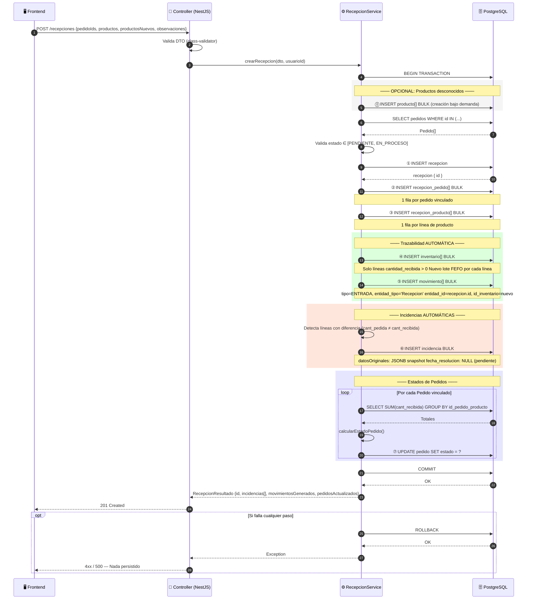
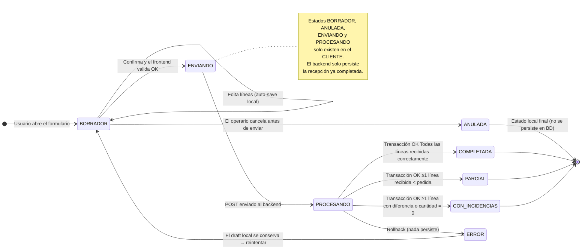
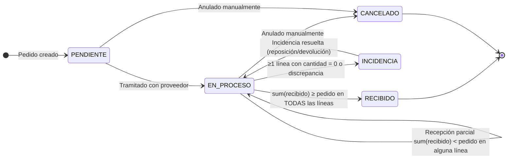
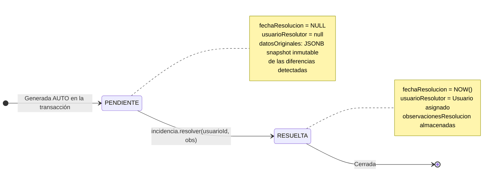
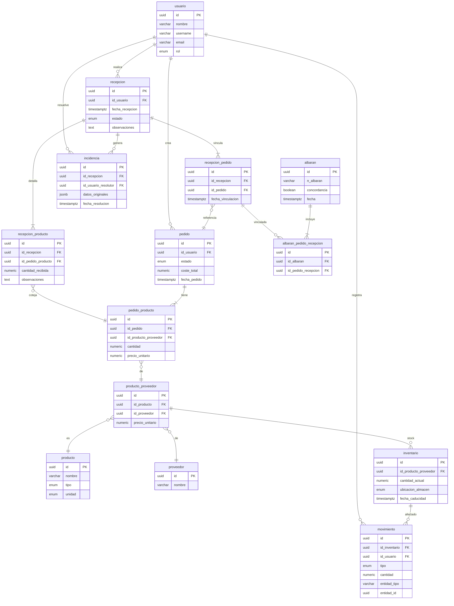

# 📊 Recepción de Productos — Diagramas

> Todos los diagramas del módulo en un único fichero ordenados por propósito.

---

## 1. 🧩 UML de Clases — Dominio Completo

Refleja las **entidades reales del código** con sus relaciones exactas.

---

## 2. 📌 Casos de Uso

---

---

## 2b. 📷 Flujo de Escaneo de Productos (lookup + draft)

> **Clave**: en ningún punto de este flujo se escribe en la BD. Todo permanece en el estado local del cliente hasta el envío final del batch.

---

## 3. 🔄 Diagrama de Secuencia — Frontend Completo (Escaneo + Envio + Resultado)

---

## 4. 🔄 Diagrama de Secuencia — Backend (Transacción y Trazabilidad)

---

## 5. ⚙️ Máquina de Estados — `Recepcion` y `Pedido`

### Estados de la Recepcion

### Estados del Pedido impactados

### Estados de la `Incidencia`

> ⚠️ **La entidad `Incidencia` real no tiene un campo `estado` enum.** El estado se infiere del campo `fechaResolucion`:
> - `fechaResolucion = NULL` → **PENDIENTE** (sin resolver)
> - `fechaResolucion = Date` → **RESUELTA** (el método `estaResuelta()` aplica esta lógica)

---

## 6. 🗃️ ERD — Relaciones entre tablas

