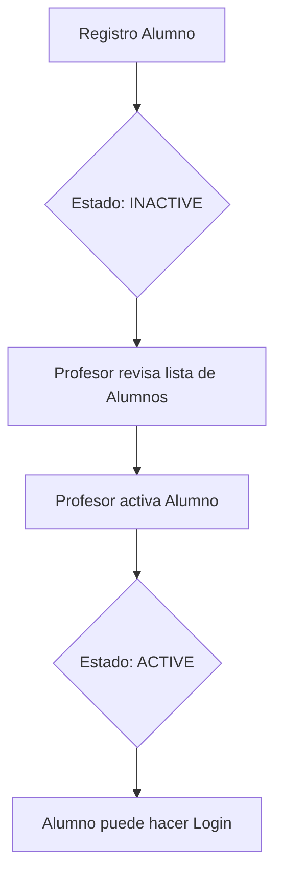

# Documentación Técnica: Sistema Educativo, Autenticación y Roles

## 1. Introducción
Este documento detalla el funcionamiento técnico del sistema de gestión de usuarios, roles y la estructura educativa (clases y grupos) del proyecto Smart Economat. El sistema está diseñado para gestionar de forma jerárquica a administradores, profesores y alumnos, asegurando que cada nivel tenga los permisos adecuados y una vinculación clara.

---

## 2. Sistema de Autenticación (Auth)
La autenticación se basa en **JSON Web Tokens (JWT)**.

### 2.1. Registro de Usuarios
Existen dos flujos principales de registro:

#### A. Registro de Alumnos
Los alumnos se registran de forma autónoma a través del `AlumnoController`. Para completar el registro, el sistema requiere:
- **Datos de cuenta**: Username, Email y Password.
- **Datos de vinculación**:
    - **Código de Clase**: Un código alfanumérico único (ej: `ABC-123`) generado por el profesor.
- **Validación**: El sistema verifica que la clase tenga cupo disponible y vincula automáticamente al alumno con el profesor dueño de la misma.

*Nota: Al registrarse, el estado inicial del alumno es `INACTIVE` hasta que su profesor lo active.*

#### B. Registro de Profesores
Los profesores pueden ser registrados por un **Administrador** o mediante un proceso de registro propio (sujeto a validación).
- Requieren un código **CIAL** único.
- Su estado inicial es `INACTIVE` hasta que un Administrador valide su cuenta.

### 2.2. Login y Sesión
El proceso de login valida:
1.  Existencia del `username` o `email`.
2.  Coincidencia de `password` (hasheada con bcrypt).
3.  Estado del usuario: Solo los usuarios con status `ACTIVE` pueden iniciar sesión.

Si el login es exitoso, se devuelve un `access_token` que contiene el `id`, `username` y `rol` del usuario.

### 2.3. Gestión de Contraseñas
- **Cambio de Contraseña Forzado**: El sistema puede obligar a un usuario a cambiar su contraseña en el próximo login (`mustChangePassword: true`).
- **Restablecimiento**: 
    - Un **Administrador** puede resetear la clave de cualquier usuario.
    - Un **Profesor** puede resetear la clave de sus alumnos vinculados.
    - Se genera una clave provisional de 8 caracteres.

---

## 3. Roles y Permisos (RBAC)

El sistema define tres roles principales en el enum `rolUsuario`:

| Rol | Descripción | Capacidades Clave |
| :--- | :--- | :--- |
| **SUPER_ADMIN** | Administrador Maestro. | Acceso absoluto, gestión de plantillas de roles y permisos raíz. |
| **ADMINISTRADOR** | Administrador de Centro. | Gestión de usuarios, activación de profesores, configuración local. |
| **PROFESOR** | Gestor de Aula. | Creación de slots, activación/gestión de sus alumnos, recetas y stock. |
| **ALUMNO** | Estudiante. | Consulta de catálogo, stock y realización de pedidos supervisados. |

---

## 4. Estructura Educativa: Clases y Sesiones

El núcleo del sistema educativo se basa en la relación entre el Profesor, el Alumno y el espacio físico/temporal (la Clase).

### 4.1. Entidad `Slot` (Clase)
Define un cupo de registro creado por el profesor. Cada clase tiene un código único y una capacidad máxima definida.

### 4.2. Flujo de Vinculación
1.  El **Profesor** genera un lote de "Clases" desde su panel.
2.  El sistema genera códigos únicos (ej: `SMA-PR-01`).
3.  El **Alumno** introduce este código durante su registro.
4.  El sistema valida:
    - Que el código exista.
    - Que el slot no haya superado su capacidad de alumnos.
5.  Se crea la vinculación `Alumno -> Profesor` automáticamente.

---

## 5. Ciclo de Vida del Usuario (Activación)

Para garantizar la seguridad y el orden académico, el sistema implementa un flujo de activación manual:

1.  **Activación de Profesores**: Realizada por un `ADMIN`. Valida que el profesor pertenece a la institución.
291. **Activación de Alumnos**: Realizada por el `PROFESOR` vinculado. El sistema permite gestionar a los alumnos de forma jerárquica:
    - Agrupados por **Aula** y **Clase** mediante acordeones desplegables.
    - Acciones rápidas de activación, reseteo de clave y gestión de permisos por cada grupo.

---

# Documentación Técnica Adicional
- **Backend**: NestJS + TypeORM (PostgreSQL).
- **Frontend**: React + TypeScript.
- **Seguridad**: Bcrypt para hashing, JWT para transport de sesión.
