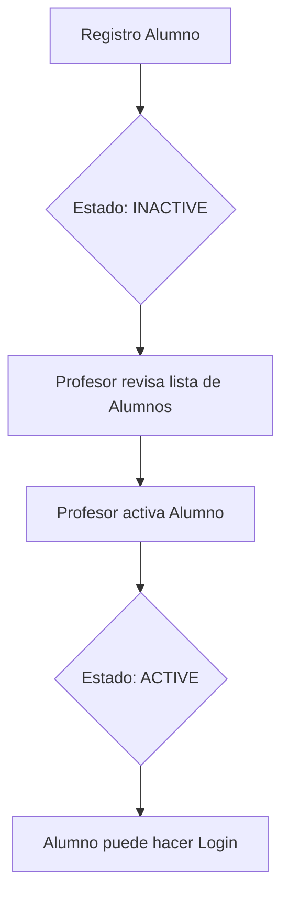

# Documentación Técnica: Sistema Educativo, Autenticación y Roles

## 1. Introducción
Este documento detalla el funcionamiento técnico del sistema de gestión de usuarios, roles y la estructura educativa (slots y sesiones) del proyecto Smart Economat. El sistema está diseñado para gestionar de forma jerárquica a administradores, profesores y alumnos, asegurando que cada nivel tenga los permisos adecuados y una vinculación clara.

---

## 2. Sistema de Autenticación (Auth)
La autenticación se basa en **JSON Web Tokens (JWT)**.

### 2.1. Registro de Usuarios
Existen dos flujos principales de registro:

#### A. Registro de Alumnos
Los alumnos se registran de forma autónoma a través del `AlumnoController`. Para completar el registro, el sistema requiere:
- **Datos de cuenta**: Username, Email y Password.
- **Datos de vinculación**:
    - **CIAL del Profesor**: Código único del profesor al que se vinculará.
    - **Aula**: Identificador del aula física o virtual.
    - **Número de Clase**: Posición o slot asignado dentro del aula.

*Nota: Al registrarse, el estado inicial del alumno es `INACTIVE` hasta que su profesor lo active.*

#### B. Registro de Profesores
Los profesores pueden ser registrados por un **Administrador** o mediante un proceso de registro propio (sujeto a validación).
- Requieren un código **CIAL** único.
- Su estado inicial es `INACTIVE` hasta que un Administrador valide su cuenta.

### 2.2. Login y Sesión
El proceso de login valida:
1.  Existencia del `username` o `email`.
2.  Coincidencia de `password` (hasheada con bcrypt).
3.  Estado del usuario: Solo los usuarios con status `ACTIVE` pueden iniciar sesión.

Si el login es exitoso, se devuelve un `access_token` que contiene el `id`, `username` y `rol` del usuario.

### 2.3. Gestión de Contraseñas
- **Cambio de Contraseña Forzado**: El sistema puede obligar a un usuario a cambiar su contraseña en el próximo login (`mustChangePassword: true`).
- **Restablecimiento**: 
    - Un **Administrador** puede resetear la clave de cualquier usuario.
    - Un **Profesor** puede resetear la clave de sus alumnos vinculados.
    - Se genera una clave provisional de 8 caracteres.

---

## 3. Roles y Permisos (RBAC)

El sistema define tres roles principales en el enum `rolUsuario`:

| Rol | Descripción | Capacidades Clave |
| :--- | :--- | :--- |
| **ADMIN** | Administrador del sistema. | Gestión total de usuarios, activación de profesores, configuración global. |
| **PROFESOR** | Gestor de un grupo de alumnos. | Creación de slots, activación/gestión de sus alumnos, control de inventario/pedidos. |
| **ALUMNO** | Usuario final (estudiante). | Realización de pedidos, gestión de su "economato" personal bajo supervisión. |

---

## 4. Estructura Educativa: Slots y Sesiones

El núcleo del sistema educativo se basa en la relación entre el Profesor, el Alumno y el espacio físico/temporal (el Slot).

### 4.1. Entidad `AlumnoSlot`
Define un espacio único en el sistema. Está indexado de forma única por la combinación de:
- `profesorId`
- `aula`
- `numeroClase`

Esto garantiza que un profesor no pueda tener dos alumnos en el mismo sitio/clase simultáneamente.

### 4.2. Entidad `Alumno`
El alumno es la entidad que ocupa un `AlumnoSlot`. Contiene una relación `1:1` con el usuario (cuenta) y el slot (espacio).

### 4.3. Flujo de Vinculación
1.  El **Profesor** crea los slots disponibles en su perfil (o se crean automáticamente durante el registro del alumno).
2.  El **Alumno** se registra proporcionando el CIAL del profesor y los datos del slot.
3.  El sistema busca el slot:
    - Si el slot existe y está libre, se le asigna al alumno.
    - Si el slot no existe, se crea uno nuevo y se vincula.
    - Si el slot está ocupado, el registro falla.

---

## 5. Ciclo de Vida del Usuario (Activación)

Para garantizar la seguridad y el orden académico, el sistema implementa un flujo de activación manual:

1.  **Activación de Profesores**: Realizada por un `ADMIN`. Valida que el profesor pertenece a la institución.
2.  **Activación de Alumnos**: Realizada por el `PROFESOR` vinculado. Valida que el alumno está físicamente en clase o pertenece a su grupo.

---

# Documentación Técnica Adicional
- **Backend**: NestJS + TypeORM (PostgreSQL).
- **Frontend**: React + TypeScript.
- **Seguridad**: Bcrypt para hashing, JWT para transport de sesión.
